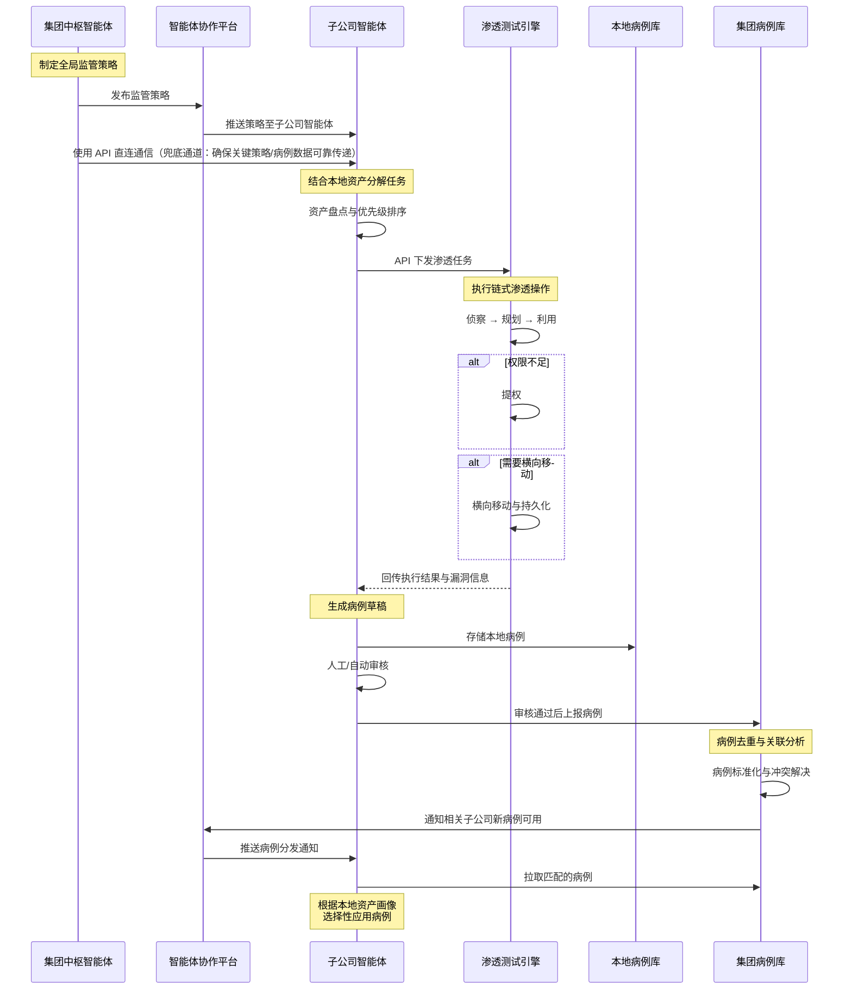
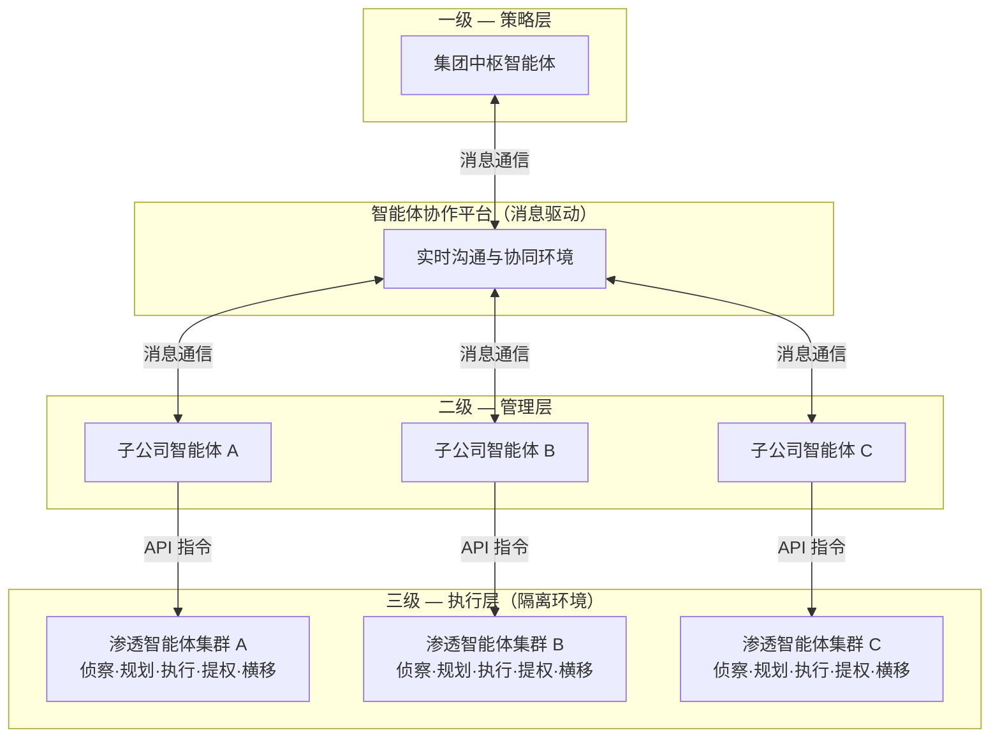

# 基于AI技术的安全渗透测试系统需求规格说明书

> **文档状态**: 已审核  
> **版本**: 1.7  
> **起草**: 董亮  
> **修订**: 董亮、王士锋、陈郅、韩昱  
> **审核**: 谢路明  
> **最后更新**: 2026 年 7 月 10 日  
> **适用范围**: 集团及所有子公司内部网络安全防护体系  

---

## 目录

1. [引言](#1-引言)
2. [项目概述](#2-项目概述)
3. [功能需求](#3-功能需求)
   - [3.1 集团监管平台（监管层）](#31-集团监管平台监管层)
   - [3.2 子公司自主管理平台（管理层）](#32-子公司自主管理平台管理层)
   - [3.3 渗透测试引擎（执行层）](#33-渗透测试引擎执行层)
   - [3.4 智能体协作体系](#34-智能体协作体系)
4. [接口需求](#4-接口需求)
5. [非功能需求](#5-非功能需求)
6. [项目计划与验收](#6-项目计划与验收)
7. [附录](#7-附录)

---

## 1. 引言

### 1.1 编写目的

本文档旨在明确"基于AI技术的安全渗透测试系统"的各项功能与非功能需求，为项目的研发、测试及验收提供统一的标准和依据。

**文档适用范围**：
- 项目研发团队（平台开发组、渗透开发组、功能开发组）
- 项目评审与验收人员
- 集团及子公司安全运维团队

**读者对象与使用指引**：

| 读者角色 | 重点关注章节 | 用途 |
|----------|-------------|------|
| 平台开发组 | 第3章（功能需求）、第4章（接口需求） | 指导平台架构设计与功能开发 |
| 渗透开发组 | 第3.3节（渗透测试引擎）、第4.1节（渗透引擎API） | 指导渗透引擎与智能体开发 |
| 功能开发组 | 全文 | 需求评审、验收测试依据 |
| 安全运维团队 | 第5章（非功能需求）、第3.1节（集团监管平台） | 部署运维与安全合规参考 |

本系统通过引入大模型驱动的智能体技术，构建一套面向集团及子公司的**三级智能体协作体系**——集团中枢智能体（一级策略层）、子公司智能体（二级管理层）、渗透智能体集群（三级执行层），实现安全防护从"被动防御"向"主动免疫"的战略转型。

### 1.2 项目背景

#### 1.2.1 行业挑战

随着数字化转型的深入，集团及各子公司内部网络环境日益复杂，呈现以下核心挑战：

| 挑战维度 | 现状描述 |
|----------|----------|
| **资产规模膨胀** | 各子公司网络资产数量快速增长，攻击面持续扩大，传统人工巡检难以全覆盖 |
| **攻击手段演进** | AI 驱动的自动化攻击日益增多，攻击者利用大模型快速生成变种 Exploit，防御难度倍增 |
| **人才缺口巨大** | 国内网络安全渗透测试人才缺口超百万，资深工程师人力成本居高不下 |
| **测试频率不足** | 传统人工渗透测试受限于人力与成本，单次中大型项目需数天至数周，年度 1-2 次的测试频率远不能满足安全需求 |
| **知识沉淀薄弱** | 渗透测试经验高度依赖个人能力，缺乏标准化、可复用的安全知识库，经验难以跨团队、跨子公司共享 |

#### 1.2.2 技术突破

大语言模型（LLM）在逻辑推理、自主决策、代码生成与工具调用方面的能力突破，为渗透测试自动化提供了关键技术基础：

- **智能规划**：大模型可基于侦察信息自主分析攻击面、规划攻击路径
- **动态适配**：面对不同目标环境自主调整 Exploit 策略，无需人工预设规则
- **多智能体协同**：多个专项智能体协同作业，模拟真实攻击团队的协作模式
- **知识提取**：从每次渗透过程中自动提取攻击知识，形成可复用的结构化病例

#### 1.2.3 战略转型

本项目秉持"从被动防御到主动免疫"的安全理念，构建一套**7×24 小时不间断运行**的自动化渗透测试体系。如同生物免疫系统持续监测并清除病原体，本系统在集团内部网络中持续运行渗透测试，发现漏洞后自动沉淀为标准化"病例"，通过集团病例库实现跨子公司的安全知识共享——**一家发现漏洞，全集团获得免疫能力**。

### 1.3 术语定义

| 术语 | 英文 | 定义 |
|------|------|------|
| **集团中枢智能体** | Central Brain Agent | 系统的一级策略层智能体，驻留在集团监管平台，负责跨子公司资源协调、监管策略制定、集团病例库管理及监管数据汇总分析 |
| **子公司智能体** | Subsidiary Brain Agent | 系统的二级管理智能体，驻留在子公司自主管理平台，负责接收集团策略、结合本地资产进行任务分解、指挥渗透智能体集群、上报运行状态，具备离线自治决策能力。|
| **渗透智能体集群** | Penetration Agent Cluster | 系统的三级执行层，由侦察、规划、执行、提权、横向移动等多个专项智能体组成，在隔离环境中执行具体渗透测试操作，**不参与智能体协作平台通信** |
| **智能体协作平台** | Agent Collaboration Platform | 基于消息驱动的智能体实时沟通环境，集团中枢智能体与各子公司智能体在此进行信息交换与协同决策，支持人机共融办公 |
| **病例库** | Case Library | 核心知识库，标准化存储渗透测试中发现的漏洞详情、攻击路径、修复建议及利用证明（PoC/Exp），支持跨子公司共享与关联分析，是实现"主动免疫"的知识基础 |
| **链式操作闭环** | Chained Operation Loop | 渗透测试从初始突破点到最终目标的完整自动化攻击链路——"侦察 → 规划 → 利用 → 提权 → 横向移动"，各环节自动衔接、失败自动回退 |
| **人机共融** | Human-Agent Teaming | 管理人员可在线登录协作平台，"旁听"智能体间的对话，在关键决策点进行干预审批；人员不在线时智能体按既定策略自主运行 |
| **自治运行** | Autonomous Operation | 在无人工干预、无集团连接的情况下，子公司智能体依据本地预设策略，自主调度渗透智能体集群执行渗透测试并完成结果记录 |
| **病例共享** | Case Sharing | 子公司将本地审核后的病例上报至集团病例库，集团根据各子公司资产画像（技术栈相似度）进行精准分发，实现安全知识的跨子公司复用 |
| **紧急熔断** | Emergency Circuit Breaker | 当渗透测试导致目标系统响应延迟超过预设阈值时，自动触发的一键停止机制，立即清理所有执行载荷，防止影响业务连续性 |
| **RAG 知识库** | Retrieval-Augmented Generation | 为智能体提供攻击知识支撑的检索增强生成系统，包含粗粒度攻击知识（漏洞库、CVE）和过程级知识（Exploit PoC、安全文章） |

---

## 2. 项目概述

### 2.1 总体目标

本项目的总体目标是构建一套面向集团及子公司内部网络的基于AI技术的安全渗透测试系统，实现从"被动防御"到"主动免疫"的转变。

| 维度 | 目标 | 详细说明 |
|------|------|----------|
| **渗透能力** | 多目标自动化渗透 | 大模型驱动的智能体自主完成资产发现、漏洞探测、利用、提权、横向移动等链式操作，单节点支持不少于 100 个目标的并发探测 |
| **平台能力** | 两级监管架构 | 集团监管平台 + 子公司自主管理平台，实现渗透任务下发、结果回传、态势实时监控；子公司平台支持离线自治运行 |
| **知识沉淀** | 病例库标准化 | 将渗透测试中发现的漏洞及攻击路径标准化存储为"病例"，形成可复用、可共享的安全知识库，实现跨子公司"群体免疫" |

**核心量化指标**：

| 指标类别 | 指标项 | 目标值         |
|----------|--------|-------------|
| 渗透能力 | Web 应用漏洞发现率 | ≥ 80% |
| 渗透能力 | 内网横向移动漏洞发现率 | ≥ 70%  |
| 渗透能力 | 权限提升漏洞发现率 | ≥ 60% |
| 效率提升 | 测试时长较人工节省 | ≥ 70% |
| 平台性能 | 单节点并发探测目标数 | ≥ 100 |
| 平台性能 | 管理控制台操作响应时间 | < 2 秒       |
| 平台性能 | 实时日志展示延迟 | < 1 秒       |
| 可用性 | 集团平台可用性 | ≥ 99.9%     |
| 可用性 | 子公司节点自治运行时长 | 7×24h       |

**量化指标测量口径说明**：

| 指标项                    | 测量口径与前置条件 |
|------------------------|-------------------|
| Web 应用漏洞发现率 ≥ 80%  | 基于已知漏洞数量的标准测试靶场作为 Ground Truth（如 Xbow Benchmark、Vulhub 等），测试靶场至少包含 50 个已标记的独立漏洞样本（含 CVE 编号或唯一标识），覆盖 OWASP Top 10（2021）各类漏洞类型。计算公式：发现率 = 自动化发现的漏洞数 ÷ 靶场已知漏洞总数。以靶场预置的漏洞清单为基准分母，不依赖人工渗透确认结果 |
| 内网横向移动漏洞发现率 ≥ 70% | 基于标准 AD 域环境测试用例，包含至少 5 种横向移动路径（Pass-the-Hash、Kerberoasting、SMB Relay、WMI 横向、WinRM 横向），靶场参考 Vulhub、Hack the box等|
| 权限提升漏洞发现率 ≥ 60% | 基于标准 Linux/Windows 提权测试环境，包含内核漏洞、SUID 误配置、计划任务劫持等至少 4 类提权场景；靶场参考 Vulhub、Hack the box等|
| 测试时长较人工节省 ≥ 70% | 对照基准：同规模资产范围（50 个目标 IP）下，中级渗透测试工程师人工完成"侦察→利用→提权→横移"全链路所需的平均时间。节省率 = (人工时长 - 自动化时长) ÷ 人工时长 × 100% |
| 单节点并发探测目标数 ≥ 100 | "目标"定义为独立 IP 地址，每个目标同时执行端口扫描 + 服务识别。测试条件：标准扫描强度，单节点 8 vCPU / 16 GB RAM |
| 管理控制台操作响应时间 < 2 秒      | 测量点：浏览器发起请求到页面渲染完成（P95）。排除网络传输延迟（测量于局域网环境）。包含：页面切换、列表查询（≤ 100 条记录）、图表加载 |
| 实时日志展示延迟 < 1 秒         | 测量点：渗透引擎日志写入时间戳到管理平台前端展示时间戳的差值（P99）。排除网络传输延迟 |
| 渗透引擎 API 响应时间 < 1 秒（P99） | 测量点：API 网关收到请求到返回响应首字节。含任务下发、状态查询接口。测试条件：并发请求数 ≤ 50 |
| 协作平台消息延迟 < 500 毫秒      | 测量点：发送方消息写入时间戳到接收方消息投递确认时间戳的端到端差值（P99） |
| 病例检索响应时间 < 3 秒         | 测量条件：10 万条病例数据，全文搜索（关键词匹配标题+描述），排除冷启动缓存预热时间 |

**系统边界约束**：

| 约束类别 | 约束项 | 设计上限 | 超限行为 |
|----------|--------|----------|----------|
| **规模约束** | 最大接入子公司数 | 100 | 超过需增加集团平台实例，通过联邦模式扩展 |
| **规模约束** | 单子公司最大管理资产数 | 10,000 IP | 超过建议拆分为多节点部署 |
| **规模约束** | 集团病例库最大容量 | 100 万条病例 | 超过需启用归档策略，历史病例迁移至冷存储 |
| **任务约束** | 单任务最大执行时长 | 24 小时（timeout 可配置） | 超时自动终止，记录中断点 |
| **任务约束** | 单任务最大目标数 | 500 IP | 超过需拆分为多个子任务 |
| **任务约束** | 链式操作最大深度 | 5 层（侦察→利用→提权→横移），持久化为横向移动阶段的子功能 | 到达最大深度后自动终止横向扩展，汇总结果 |
| **数据约束** | 单条病例数据最大大小 | 10 MB（含附件） | 超限附件存储至外部对象存储，病例记录保留引用链接 |
| **数据约束** | 离线数据最大缓存量 | 10 GB（本地磁盘） | 超过后按优先级淘汰：先丢弃心跳日志，再丢弃非关键运行日志，保留病例数据与告警 |
| **并发约束** | 单节点最大并发渗透任务数 | 10 | 超过排队等待，按优先级调度 |
| **并发约束** | 协作平台最大并发连接数 | 1000（含智能体 + 人工用户） | 超过限流，返回 HTTP 429 |

### 2.2 系统架构

系统采用**三级智能体体系**（策略层→管理层→执行层），由四个核心逻辑层承载，其中通信层为连接一级与二级智能体的基础设施层，本身不包含独立业务智能体：

```mermaid
graph TB
    subgraph "集团监管平台（监管层）"
        direction TB
        CentralAgent[集团中枢智能体<br/>一级 — 策略层]
        Dashboard[安全监管看板]
        CaseLib[集团病例库]
        Monitor[态势监控中心]
        CrossMgmt[跨子公司管理]
    end

    subgraph "智能体协作平台（通信层 — 基础设施）"
        direction TB
        Collab[消息驱动的智能体沟通枢纽<br/>支持人机共融办公]
    end

    subgraph "子公司 A 自主管理平台（管理层）"
        direction TB
        SubAgentA[子公司智能体 A<br/>二级 — 管理层]
        TaskMgmtA[任务管理]
        EngineCtrlA[引擎调度]
        LocalCaseA[本地病例管理]
    end

    subgraph "子公司 B 自主管理平台（管理层）"
        direction TB
        SubAgentB[子公司智能体 B<br/>二级 — 管理层]
        TaskMgmtB[任务管理]
        EngineCtrlB[引擎调度]
        LocalCaseB[本地病例管理]
    end

    subgraph "渗透测试引擎 A1（执行层 — 隔离环境）"
        direction LR
        MultiAgentA1[协调智能体]
        ReconA1[侦察智能体]
        PlanA1[规划智能体]
        ExecA1[执行智能体]
        PrivA1[提权智能体]
        LatA1[横向移动智能体]
    end

   subgraph "渗透测试引擎 A2（执行层 — 隔离环境）"
      direction LR
      MultiAgentA2[协调智能体]
      ReconA2[侦察智能体]
      PlanA2[规划智能体]
      ExecA2[执行智能体]
      PrivA2[提权智能体]
      LatA2[横向移动智能体]
   end

   subgraph "渗透测试引擎 B1（执行层 — 隔离环境）"
      direction LR
      MultiAgentB1[协调智能体]
      ReconB1[侦察智能体]
      PlanB1[规划智能体]
      ExecB1[执行智能体]
      PrivB1[提权智能体]
      LatB1[横向移动智能体]
   end
   
   subgraph "渗透测试引擎 B2（执行层 — 隔离环境）"
      direction LR
      MultiAgentB2[协调智能体]
      ReconB2[侦察智能体]
      PlanB2[规划智能体]
      ExecB2[执行智能体]
      PrivB2[提权智能体]
      LatB2[横向移动智能体]
   end

    CentralAgent <-->|消息通信| Collab
    Collab <-->|消息通信| SubAgentA
    Collab <-->|消息通信| SubAgentB
    
    CentralAgent <-->|API</br>数据直连通信</br>（兜底通道）| SubAgentA
    CentralAgent <-->|API</br>数据直连通信</br>（兜底通道）| SubAgentB

    SubAgentA -->|API</br>指令下发| MultiAgentA1
    MultiAgentA1 --> ReconA1
    MultiAgentA1 --> PlanA1
    MultiAgentA1 --> ExecA1
    MultiAgentA1 --> PrivA1
    MultiAgentA1 --> LatA1

    SubAgentA -->|API</br>指令下发| MultiAgentA2
    MultiAgentA2 --> ReconA2
    MultiAgentA2 --> PlanA2
    MultiAgentA2 --> ExecA2
    MultiAgentA2 --> PrivA2
    MultiAgentA2 --> LatA2

   SubAgentB -->|API</br>指令下发| MultiAgentB1
   MultiAgentB1 --> ReconB1
   MultiAgentB1 --> PlanB1
   MultiAgentB1 --> ExecB1
   MultiAgentB1 --> PrivB1
   MultiAgentB1 --> LatB1
   
   SubAgentB -->|API</br>指令下发| MultiAgentB2
   MultiAgentB2 --> ReconB2
   MultiAgentB2 --> PlanB2
   MultiAgentB2 --> ExecB2
   MultiAgentB2 --> PrivB2
   MultiAgentB2 --> LatB2

    CaseLib -.->|病例分发| LocalCaseA
    CaseLib -.->|病例分发| LocalCaseB
    LocalCaseA -.->|病例上报| CaseLib
    LocalCaseB -.->|病例上报| CaseLib

    style CentralAgent fill:#e3f2fd
    style Collab fill:#f3e5f5
    style SubAgentA fill:#fff3e0
    style SubAgentB fill:#fff3e0
```



**各层职责说明**：

| 层级 | 定位 | 是否含智能体 | 核心组件 | 关键职责 |
|------|------|-------------|----------|----------|
| **监管层** | 集团监管平台 | 是（一级） | 集团中枢智能体、安全监管看板、集团病例库、态势监控中心 | 全局态势感知、策略制定与下发、病例汇总与分发、跨子公司协调 |
| **通信层** | 智能体协作平台 | 否（基础设施） | 消息引擎、人机交互界面、会话管理 | 集团中枢智能体与各子公司智能体的实时沟通枢纽，支持人机共融 |
| **管理层** | 子公司自主管理平台 | 是（二级） | 子公司智能体、任务管理、引擎调度、本地病例管理 | 接收集团策略、结合本地资产分解任务、指挥渗透智能体、上报状态，具备离线自治能力 |
| **执行层** | 渗透测试引擎 | 是（三级） | 渗透智能体集群（侦察/规划/执行/提权/横移） | 在隔离环境中执行具体渗透操作，**仅通过 API 接受管理层指令，不参与协作平台通信** |

> **说明**："三级智能体体系"指策略层（集团中枢智能体）、管理层（子公司智能体）、执行层（渗透智能体集群）三级业务智能体。通信层（智能体协作平台）为连接一级与二级智能体的消息基础设施，本身不包含独立业务智能体，因此不计入智能体层级计数。

**架构关键约束**：

| 约束项 | 说明                                                                                              |
|--------|-------------------------------------------------------------------------------------------------|
| **渗透智能体通信边界** | 渗透智能体集群**仅通过 RESTful API 与所属子公司管理平台交互**，不直接接入智能体协作平台                                            |
| **隔离执行** | 渗透测试引擎须在受限沙箱环境（Docker 容器）中运行，禁止访问非授权宿主机资源                                                       |
| **离线自治** | 子公司智能体在断开集团连接时，仍能按本地预设策略自主调度渗透任务                                                                |
| **数据流向** | 执行结果由渗透智能体 → 子公司管理平台 → 集团监管平台，逐级上报                                                              |
| **组件版本兼容性** | 子公司管理平台与渗透引擎之间通过 API 版本号约定兼容性：管理平台大版本（v1↔v2）升级时需同步升级渗透引擎适配层；渗透引擎小版本（v1.0↔v1.1）升级须向后兼容，不影响管理平台调用 |
| **扫描重叠保护** | 若单次扫描任务耗时超过扫描间隔（如配置为每 4 小时扫描，上次扫描尚未完成），跳过本次触发并记录日志，等待下次调度窗口                                     |
| **双平面通信设计** | 集团中枢智能体与子公司智能体之间维护两条通信路径：协作平台（主通道，支持人机交互与消息持久化）和 API 直连（兜底通道，确保策略下发、病例上传与分发、数据传递等关键数据的可靠传递）。两平面数据冲突时默认以 API 直连通道为准，可通过配置开关切换策略（`API优先` / `协作平台优先` / `人工裁决`）。**版本号机制**：每条消息携带发送方单调递增的序列号 + 发送方 ID（格式：`{sender_id}:{seq_num}`），协作平台与 API 直连各自维护独立序列号空间。**冲突检测粒度**：按消息 ID 逐条比对。**检测窗口**：协作平台恢复后，系统比对**协作平台离线时长 + max(15 分钟, 2×|Δt|) 缓冲窗口**内两组通道的消息序列号，以序列号较高者（较新数据）覆盖较低者。其中 Δt 为集团平台与子公司平台之间的时钟偏差值——协作平台与 API 直连通道建立连接时交换各自当前时间戳，计算偏差值 Δt。若 |Δt| > 30 秒，触发告警并暂停自动冲突裁决，切换至「人工裁决」模式，待时钟偏差修复后恢复自动裁决。**审计完整性**：冲突处理全过程记录审计日志，包含冲突消息 ID、双方数据内容摘要（SHA-256 hash）、裁决结果与操作时间 |

### 2.3 业务流程

#### 2.3.1 核心业务流程



#### 2.3.2 异常处理流程

| 异常场景 | 处理机制 | 恢复策略 |
|----------|----------|----------|
| **渗透任务导致目标响应延迟过高** | 紧急熔断：自动触发暂停，清理所有执行载荷 | 确认目标恢复后，降级测试强度重试 |
| **智能体进程崩溃** | 管理平台检测心跳超时，自动重启 | 断点续传，从最近检查点恢复任务 |
| **子公司与集团网络断开** | 子公司智能体切换为离线自治模式 | 网络恢复后批量上报积压数据 |
| **Exploit 执行失败** | 记录失败原因，请求规划智能体提供替代方案 | 尝试次优 Exploit 或标记为"需人工分析" |
| **病例上报冲突** | 集团病例库检测重复病例，触发冲突解决 | 基于 CVSS 评分、验证通过率等择优合并 |
| **LLM 服务不可用** | 规划智能体降级为基于规则（Rule-based）的静态决策模式，使用预设 Exploit 优先级列表 | LLM 服务恢复后自动切回智能决策模式，期间产生的决策记录标注"降级模式" |
| **第三方 API（资产发现/漏洞扫描）不可用或限流** | 侦察智能体切换为本地扫描模式（Nmap/ nuclei 等内置工具），结果标注数据源 | API 恢复后补充扫描并合并结果 |
| **数据库连接中断** | 子公司智能体将待写入数据缓存至本地文件队列（SQLite 降级存储），核心任务继续内存执行 | 数据库恢复后按时间顺序回放缓存数据，通过 Trace ID 去重 |
| **磁盘空间不足（< 10%）** | 触发告警，自动清理超过保留期的历史日志与临时文件；暂停新任务创建但允许进行中任务完成 | 磁盘空间恢复至 > 20% 后自动恢复新任务接收 |
| **子公司长时间离线（> 24 小时）** | 集团监管平台将该节点标记为"离线异常"并告警；子公司侧继续自治运行，本地累积数据 | 网络恢复后按优先级上报：先上传 Critical/High 漏洞告警，再批量同步病例与运行摘要 |
| **病例库 schema 变更（新增/修改字段）** | 集团病例库版本化管理，子公司上报时自动检测版本不匹配，提示升级 | 子公司升级至匹配版本后恢复上报；旧版本病例在过渡期可只读访问 |
| **同一资产被多个任务并发渗透** | 子公司智能体通过资产锁（Distributed Lock）确保同一时刻仅一个任务操作同一目标资产 | 后续任务排队等待，超时（默认 30 分钟）后自动跳过并告警 |
| **消息队列积压（协作平台）** | 监控队列深度，超过阈值（默认 10000 条）时触发告警并自动扩容消费者实例 | 积压清除后恢复正常，期间非关键消息（心跳、运行摘要）可降频发送 |
| **任务执行超时** | 任务超过预设 `timeout` 后强制终止，记录已完成进度和中断点 | 支持基于中断点创建续接任务，或标记为"超时未完成"等待人工处理 |
| **协作平台与 API 数据冲突** | 系统默认以 API 直连通道的数据为准。协作平台恢复后自动比对两者数据版本，以 API 数据覆盖协作平台数据 | 冲突处理策略可通过配置开关切换（`API优先` / `协作平台优先` / `人工裁决`），默认 `API优先` |
| **子公司离线重连后策略版本冲突（脑裂）** | 子公司重连后，首先比对本地策略版本号与集团当前策略版本号。若策略版本不一致，子公司暂停所有新任务创建，优先同步集团最新策略。同步完成后，对比离线期间本地决策与集团策略的兼容性——冲突决策标记为"待人工审核" | 子公司侧执行中的任务不受影响可正常完成；新任务须按集团最新策略执行；冲突决策由人工审核确认 |

#### 2.3.3 7×24h 运行模式

| 运行模式 | 描述 | 触发条件 |
|----------|------|----------|
| **自主扫描** | 定期扫描资产，发现新漏洞 | 定时任务（默认每 4 小时） |
| **自主渗透** | 基于漏洞优先级自主发起渗透测试 | 发现高危漏洞时自动触发 |
| **病例同步** | 接收集团分发的病例，匹配本地资产 | 集团推送新病例时 |
| **状态上报** | 向集团监控中心上报运行状态 | 定时任务（默认每 30 分钟） |
| **异常自愈** | 检测智能体异常并自动恢复 | 智能体心跳超时或错误率超阈值 |
| **离线自治** | 与集团断开时按本地策略继续运行 | 网络中断时自动切换 |

---

## 3. 功能需求

### 3.1 集团监管平台（监管层）

集团监管平台是系统的**一级策略层**，集团中枢智能体驻留于此，负责全局态势感知、策略制定与下发、病例汇总分发及跨子公司资源协调。

#### 3.1.1 安全监管看板

**功能描述**：
为集团安全管理人员提供全集团子公司的安全态势总览，以可视化方式展示关键安全指标。

**核心指标**：

| 指标类别 | 具体指标 | 展示形式 |
|----------|----------|----------|
| **渗透覆盖** | 各子公司渗透测试覆盖率、完成任务数/总任务数、活跃渗透目标数 | 环形图 + 趋势折线图 |
| **漏洞态势** | 漏洞严重等级分布（Critical/High/Medium/Low）、新增漏洞趋势、漏洞修复完成率 | 堆叠柱状图 + 趋势线 |
| **病例统计** | 累计病例数、本月新增病例、跨子公司共享次数、病例质量评分分布 | 数字卡片 + 热力地图 |
| **运行状态** | 各子公司节点在线状态、7 日可用率、平均响应时间 | 状态指示灯 + 列表 |

**交互功能**：
- 支持按子公司、按时间段、按漏洞类型的多维度筛选与钻取
- 点击任意指标可下钻至明细数据页面
- 支持看板配置的保存与导出（PDF/Excel）
- 异常指标自动高亮并触发告警通知

#### 3.1.2 集团病例库管理

**功能描述**：
集团病例库是系统的核心知识沉淀中心，汇总所有子公司上报的漏洞及攻击路径，经过标准化、去重、关联分析后形成可复用的安全知识资产，并支持向子公司精准分发——实现"一家发现漏洞，全集团获得免疫"。

**3.1.2.1 病例标准化存储**

每一条病例包含以下标准化字段：

| 字段类别 | 字段名 | 说明 |
|----------|--------|------|
| **基础信息** | 病例 ID、创建时间、上报子公司、病例状态 | 唯一标识与溯源 |
| **漏洞信息** | CVE 编号、漏洞名称、CVSS 评分、漏洞类型、影响范围 | 结构化漏洞描述 |
| **攻击路径** | 入口资产、利用链（步骤序列）、最终影响 | 完整攻击路径记录 |
| **利用证明** | PoC 代码/Exp、验证截图、利用成功条件 | 可复现的利用证据 |
| **修复建议** | 补丁信息、配置修改、防火墙规则、临时缓解措施 | 分级修复方案 |
| **关联元数据** | 关联病例 ID、关联资产指纹、技术栈标签 | 支持关联分析 |

**3.1.2.2 病例多维检索**

- 支持按漏洞类型（如 SQL 注入、RCE、权限提升等）、受影响系统/组件、攻击复杂度、CVSS 评分范围等维度检索
- 支持全文搜索与模糊匹配
- 支持按技术栈标签（如"Java/Spring/PostgreSQL"）匹配相关病例
- 检索结果支持按严重程度、发现时间、共享次数排序

**3.1.2.3 病例自动关联分析**

- 识别不同子公司上报的同类漏洞，自动建立关联关系
- 基于攻击路径相似度，发现共性风险模式
- 基于资产指纹（OS、中间件、应用版本）自动匹配受影响范围
- 生成关联分析报告，辅助集团安全策略决策

**3.1.2.4 病例去重与冲突解决**

当多个子公司对同一漏洞上报病例时：

| 冲突场景 | 解决策略 | 优先级规则 |
|----------|----------|------------|
| 同一漏洞的不同修复方案 | 合并互补措施，标注各方案的适用场景 | 引用次数多者优先推荐 |
| 同一攻击路径的不同 PoC | 保留多个 PoC，标注验证通过率 | 验证通过率高者为主方案 |
| 病例质量差异 | 合并为综合病例，保留各来源的贡献记录 | 采纳高质量字段，标注差异 |

**3.1.2.5 病例质量审核**

- 病例上报后进入"待审核"状态
- 集团安全管理员审核病例的准确性、完整性、可复现性
- 支持审核意见反馈，退回子公司补充修改
- 审核通过的病例进入"已发布"状态，自动纳入分发池

**3.1.2.6 病例智能分发**

集团病例库基于各子公司资产画像进行精准分发：

| 分发策略 | 说明 |
|----------|------|
| **技术栈匹配度分发** | 计算病例涉及的技术栈与子公司资产的相似度，高匹配度优先推送 |
| **严重等级优先分发** | Critical/High 级别病例向所有子公司强制推送 |
| **订阅条件过滤** | 子公司可预设订阅条件（如排除特定技术栈、特定漏洞类型），按需接收 |
| **手动拉取** | 子公司可主动检索并拉取需要的病例 |

**病例分发流程**：
1. 集团病例库检测到新发布病例
2. 自动化匹配各子公司资产画像，计算匹配度（默认推送阈值：匹配度 ≥ 60%）
3. 向匹配度超过阈值的子公司发送"新病例可用"通知
4. 子公司智能体接收通知，根据本地订阅条件决定是否拉取
5. 子公司拉取后，病例自动进入本地病例库并触发资产匹配
6. **退订与误报反馈**：子公司可标记已接收病例为"不适用"或"误报"，反馈数据用于优化后续匹配算法
7. **修复效果反馈**：子公司应用病例中的修复建议后，将修复状态（`已修复` / `部分修复` / `不适用` / `修复失败`）回传集团病例库，附修复时间与复测结果
8. **病例生命周期跟踪**：集团病例库跟踪每个病例在全集团的分发与修复状态，当某病例累计反馈"已修复"率达到配置阈值（默认 80%）时自动更新病例标签为"广泛已修复"，并在后续扫描确认后标注为"已验证修复"

**分发失败补偿策略**：

| 失败场景 | 处理策略 |
|----------|----------|
| 子公司离线 | 标记病例为"待分发"，每 30 分钟重试一次，最长重试 48 小时；超时后标记为"分发失败"，待子公司上线后主动拉取 |
| 子公司拉取失败 | 返回错误码后重新推送，最多重试 3 次，仍失败则标记为"拉取异常"并告警 |
| 病例版本冲突 | 子公司已存在旧版本时增量更新，保留版本历史 |

#### 3.1.3 态势监控中心

**功能描述**：
实时监控各子公司执行节点的运行状态与任务执行情况，为集团安全管理人员提供全局运营视图。

**监控指标**：

| 监控类别 | 具体指标 | 告警阈值 |
|----------|----------|----------|
| **节点状态** | 在线/离线状态、最后心跳时间 | 心跳超时 > 5 分钟告警 |
| **资源使用** | CPU 使用率、内存占用、磁盘空间、网络带宽 | CPU > 80%、内存 > 85% 告警 |
| **任务执行** | 活跃任务数、任务队列长度、平均任务完成时间 | 队列积压 > 50 告警 |
| **智能体健康** | 各智能体实例状态、错误率、重启次数 | 错误率 > 10% 或重启 > 3 次/小时告警 |
| **熔断事件** | 紧急熔断触发次数、触发原因、恢复时间 | 单日熔断 > 5 次告警 |
| **时钟同步** | 集团↔子公司 NTP 时钟偏差值 | |Δt| > 30 秒告警 |

**交互功能**：
- 实时展示当前活跃任务的执行进度条及关键日志输出
- 支持按子公司、按智能体角色筛选监控视图
- 历史监控数据的回放与趋势分析
- 告警事件的时间线展示与处理记录

#### 3.1.4 跨子公司管理

**功能描述**：
提供多子公司的统一接入管理与监管策略配置。

**核心功能**：

| 功能 | 说明 |
|------|------|
| **子公司接入管理** | 子公司注册、审批、注销；配置子公司基本信息、网络范围、管理员账户 |
| **监管策略模板** | 预定义监管策略模板（如"全面渗透"、"仅高危漏洞"、"合规检查"），支持自定义 |
| **策略下发** | 选择目标子公司，一键下发监管策略；支持定时策略与即时策略 |
| **全局指令** | 支持针对特定高危漏洞向所有子公司下达"全集团紧急排查"指令 |
| **权限配置** | 为每个子公司配置独立的操作权限范围与数据可见性 |
| **审计日志** | 记录所有跨子公司管理操作，支持回溯审计 |
| **子公司注销** | 子公司退出流程：停止该子公司所有活跃任务 → 子公司智能体下线 → 销毁 API Key → 保留历史数据（审计留存期限） → 从活跃节点列表中移除。已上报的病例不因子公司注销而删除 |

**监管策略分类**（策略的具体结构与字段定义在设计阶段详细设计）：

| 策略类别 | 说明 | 配置项示例 |
|----------|------|-----------|
| **扫描策略** | 控制扫描频率、强度、时段、目标范围 | 扫描间隔 `4h`、扫描强度 `standard`、允许时段 `22:00-06:00`、第三方 API `enabled` |
| **安全控制策略** | 控制允许/禁止的渗透操作类型、Exploit CVSS 门槛、熔断阈值 | 禁止操作 `[dos, data_destruction]`、自动执行门槛 `CVSS ≥ 6.0`、需审批门槛 `CVSS ≥ 9.0`、熔断延迟阈值 `2000ms` |
| **病例分发策略** | 控制病例推送匹配度阈值、强制推送等级、自动拉取规则 | 推送匹配度 `≥ 60%`、强制推送 `[critical, high]`、Critical 级别自动拉取 |
| **告警与上报策略** | 控制心跳频率、摘要上报间隔、告警渠道与阈值 | 心跳 `30s`、摘要上报 `30min`、告警渠道 `[wechat, email]`、告警门槛 `high` |

以上策略以 JSON 格式定义，集团通过协作平台策略通道下发，通过 API 直连通道兜底（参见 §2.2 双平面通信设计）。每个策略携带版本号，子公司在离线恢复后通过版本号比对检测策略变更（参见 §2.3.2 脑裂处理）。

---

### 3.2 子公司自主管理平台（管理层）

子公司自主管理平台是系统的**二级管理层**，子公司智能体驻留于此，负责本地化自治决策、任务分解、渗透智能体集群调度及状态上报。

#### 3.2.1 智能体运行环境

**功能描述**：
为子公司智能体提供稳定、安全、可控的运行环境，确保其在各种网络条件下正常运行。

**核心特性**：

| 特性 | 说明 |
|------|------|
| **本地化自治决策** | 在断开集团连接时，子公司智能体根据本地预设策略（如资产优先级、漏洞严重度阈值）自主决策渗透任务，确保 7×24h 不间断运行 |
| **资源配额管理** | 根据资产重要等级动态调整渗透测试的资源配额（CPU/内存/网络带宽），防止渗透测试影响业务系统性能 |
| **全链路追踪** | 为每个渗透任务分配全局唯一 Trace ID（OpenTelemetry 标准），实现从任务创建到结果上报的全链路操作回溯 |
| **检查点机制** | 链式操作每完成一个阶段（侦察→利用→提权→横移）自动保存检查点（Checkpoint），检查点数据包含：当前链路状态、已完成步骤、已获取权限、待尝试路径。检查点持久化至子公司本地数据库，支持断点续传 |
| **紧急熔断** | 实时监测渗透目标的业务性能响应，当响应延迟、错误率等指标超过预设阈值时，自动执行紧急熔断——立即停止当前渗透操作、清理执行载荷、记录熔断事件 |
| **自愈恢复** | 检测子公司智能体运行异常（崩溃、死锁、资源枯竭），自动重启并恢复至最近的检查点状态 |
| **版本热更新** | 支持对智能体模型与规则库的在线更新，不中断当前执行的渗透任务 |

**熔断策略配置**：

| 熔断参数 | 默认值 | 说明 |
|----------|--------|------|
| 目标响应延迟阈值 | > 2000ms | 超过此阈值触发熔断 |
| 目标错误率阈值 | > 5% | 5 分钟内错误率超过此阈值触发熔断 |
| 熔断冷却时间 | 300 秒 | 熔断后冷却期内不再调度该目标 |
| 半开探测 | 允许 | 冷却期后以低强度探测确认目标恢复 |
| 全局限流 | 100 req/s | 单目标最大请求速率 |

#### 3.2.2 渗透任务管理

**功能描述**：
子公司智能体根据集团策略和本地资产情况，自主创建、分配和管理渗透测试任务。

**3.2.2.1 资产管理**

| 功能 | 说明 |
|------|------|
| **自动发现** | 通过第三方 API 或本地扫描自动发现内网资产（IP、域名、服务、应用） |
| **手动维护** | 支持手动添加、编辑、删除资产信息，批量导入/导出 |
| **资产分级** | 按业务重要性将资产分为核心、重要、一般三级，不同级别对应不同的测试强度与资源配额 |
| **指纹库** | 自动识别并记录资产的 OS 类型、中间件版本、开放端口、服务指纹 |
| **变更检测** | 定期扫描检测资产变更（新增、下线、指纹变化），自动更新资产台账 |

**3.2.2.2 任务类型**

| 任务类型 | 触发方式 | 说明 |
|----------|----------|------|
| **定时任务** | Cron 表达式 | 按固定周期自动执行，如"每日凌晨扫描核心资产" |
| **即时任务** | 手动创建 / API 触发 | 立即执行的一次性渗透任务 |
| **事件触发任务** | 事件监听 | 基于特定事件自动触发，如"新资产上线时自动扫描"、"集团下发高危漏洞排查指令时自动执行" |
| **重测任务** | 病例驱动 | 针对已修复漏洞的复测验证，确认修复有效性 |

**3.2.2.3 任务优先级策略**

子公司智能体根据以下维度自动计算任务优先级：

| 优先级因子 | 权重 | 说明 |
|------------|------|------|
| 漏洞严重度 | 高 | Critical/High 漏洞任务优先执行 |
| 资产重要性 | 高 | 核心资产任务优先于一般资产 |
| 集团指令 | 最高 | 集团下发的全局排查指令直接置顶 |
| 等待时间 | 中 | 同等条件下等待时间长的任务优先 |
| 历史成功率 | 低 | 历史成功率高的渗透路径优先尝试 |

**优先级计算规则**：优先级因子加权求和产生任务评分（0-100）。同等评分任务按"先入先出（FIFO）"原则调度。集团指令标记为最高优先级（固定评分 100），无需参与加权计算，直接置顶执行。

**任务生命周期状态机**：

```
                    ┌─────────┐
                    │  已创建  │
                    └────┬────┘
                         │ 调度
                    ┌────▼────┐
                    │  排队中  │
                    └────┬────┘
                         │ 分配引擎
                    ┌────▼────┐
              ┌─────│  执行中  │─────┐
              │     └────┬────┘     │
              │          │          │
        暂停/熔断    执行完成    超时/失败
              │          │          │
         ┌────▼────┐ ┌───▼───┐ ┌───▼───┐
         │  已暂停  │ │ 已完成 │ │  失败  │
         └────┬────┘ └───┬───┘ └───┬───┘
              │          │          │
         恢复/继续  → 生成病例   人工介入
              │
         重新进入"执行中"
```

#### 3.2.3 引擎调度与监控

**功能描述**：
子公司智能体支配渗透智能体集群执行渗透测试，实时获取执行状态，动态调整调度策略。

**核心功能**：

| 功能 | 说明 |
|------|------|
| **智能体分配** | 根据渗透任务的类型和复杂度，动态选择并分配渗透智能体角色 |
| **并发控制** | 动态调整并发线程数，单节点支持不少于 100 个目标并发探测 |
| **攻击图可视化** | 实时展示渗透攻击图（Attack Graph），可视化攻击路径的演进过程——已突破节点、正在尝试的路径、失败回溯路径 |
| **状态实时推送** | 通过 Server-Sent Events 或 WebSocket 实时推送任务进度、智能体日志、关键发现 |
| **健康检查** | 定期检查各渗透智能体的运行状态，异常时自动重启并重新分配任务 |
| **任务干预** | 支持管理人员手动暂停、恢复、停止、强制终止正在执行的渗透任务 |

#### 3.2.4 本地病例管理

**功能描述**：
管理本地渗透测试生成的详细报告及证据，支持审核后上报集团病例库。

**核心功能**：

| 功能 | 说明 |
|------|------|
| **病例自动生成** | 渗透任务完成后，自动提取漏洞详情、攻击路径、PoC、修复建议，生成结构化病例草稿 |
| **病例审核** | 本地安全管理员审核病例的准确性与完整性，支持批注修改、退回补充、批准上报 |
| **病例存储** | 本地病例按标准化格式存储，支持历史版本管理 |
| **病例搜索** | 本地病例的多维度检索与分类浏览 |
| **病例上报** | 审核通过后一键上报至集团病例库，支持批量上报 |
| **病例接收** | 自动接收集团分发的病例，匹配本地资产后标记"待处理"或"不适用" |
| **去重检查** | 上报前自动与本地及集团病例库比对，避免重复上报 |

#### 3.2.5 状态上报

**功能描述**：
子公司智能体定期向集团监管平台自动上报运行状态与渗透测试结果。

**上报内容**：

| 上报类型 | 频率 | 内容 |
|----------|------|------|
| **心跳** | 每 30 秒 | 节点在线状态、基本资源占用 |
| **运行摘要** | 每 30 分钟 | 活跃任务数、完成数、发现的漏洞统计、智能体健康状态 |
| **关键事件** | 实时推送 | 发现 Critical/High 漏洞、触发熔断、智能体异常、任务失败 |
| **病例上报** | 审核后即时 | 经审核的完整病例数据 |
| **审计日志** | 每小时 | 操作日志摘要（完整日志本地存储，按需上传） |

**离线续传**：
- 网络中断时，待上报数据缓存在本地队列
- 网络恢复后，按时间顺序批量上报，确保数据不丢失
- 离线数据最大缓存量 10 GB（本地磁盘），超过后按优先级淘汰

**多租户数据隔离**：

子公司间的数据隔离原则如下：

| 隔离维度 | 隔离方式 | 说明 |
|----------|----------|------|
| **任务数据** | 数据库行级隔离（SubsidiaryID 字段）+ PostgreSQL Row-Level Security 策略兜底 | 子公司仅可访问本公司的渗透任务 |
| **病例数据** | 审核前本地隔离，审核上报后集团共享 | 未审核的病例仅子公司本地可见 |
| **资产数据** | 数据库行级隔离 + PostgreSQL Row-Level Security 策略兜底 | 资产指纹经脱敏后可用于跨子公司病例匹配 |
| **智能体实例** | 独立容器/进程，独立 API Key | 子公司 A 智能体无法访问子公司 B 渗透引擎 |
| **监控数据** | 子公司管理员仅看本公司；集团管理员可看全部 | 按角色控制看板数据范围 |
| **隔离有效性验证** | 自动化测试：使用子公司 A 的 Token 尝试访问子公司 B 的任务/资产数据，预期返回 403 或 404 | CI/CD 集成，每次部署自动执行 |

#### 3.2.6 批量操作

**功能描述**：
支持对资产、任务、病例的批量操作，提高管理效率。

| 操作类型 | 单次最大数量 | 说明 |
|----------|-------------|------|
| **批量资产导入** | 1000 条/次 | 支持 CSV/Excel 导入，含格式校验与重复检测 |
| **批量资产导出** | 10000 条/次 | 支持按标签、按资产等级筛选导出 |
| **批量任务创建** | 50 个任务/次 | 支持基于资产标签批量创建渗透任务 |
| **批量任务控制** | 50 个任务/次 | 批量暂停/恢复/终止任务 |
| **批量病例上报** | 100 条/次 | 审核通过的病例统一上报至集团 |
| **批量病例导出** | 500 条/次 | 支持 PDF/JSON/STIX 2.1 格式导出 |

#### 3.2.7 渗透测试报告生成

**功能描述**：
支持渗透任务完成后自动生成人类可读的渗透测试报告，满足安全管理人员审查和合规审计需求。

| 功能 | 说明 |
|------|------|
| **任务报告生成** | 渗透任务完成后自动生成渗透测试报告，支持 PDF / HTML 格式导出。生成过程为异步任务，报告就绪后通过站内通知或 Webhook 通知用户 |
| **报告内容** | 任务概览（测试目标、执行时间、结果统计）、发现的漏洞详情（含 CVSS 评分、攻击路径描述、PoC 摘要）、修复建议列表（按严重等级排序）、攻击图快照（最终已突破节点与路径） |
| **报告模板** | 支持自定义报告模板（品牌 Logo、公司名称、联系方式等），提供默认模板开箱即用 |
| **批量导出** | 支持多任务报告批量导出（最多 50 个任务/次），以 ZIP 压缩包下载，每个任务一个独立 PDF 文件 |

---

### 3.3 渗透测试引擎（执行层）

渗透测试引擎是系统的**三级执行层**，由渗透智能体集群组成，在隔离的沙箱环境中执行具体渗透测试操作。

> **关键约束**：渗透智能体集群**不参与智能体协作平台通信**，所有指令由所属子公司智能体通过 API 下发，执行结果通过 API 回传至子公司管理平台。
>
> **关于规划智能体的特别说明**：规划智能体（3.3.2）虽使用 LLM 进行攻击路径推理，但仍属于执行层智能体。其 LLM 调用由子公司智能体代理转发——规划智能体提交上下文信息至子公司智能体，子公司智能体调用 LLM 后将推理结果返回规划智能体。此设计确保：
> 1. LLM API Key 统一由子公司管理平台管控，不暴露至渗透沙箱
> 2. LLM 调用日志由子公司管理平台统一审计
> 3. 当 LLM 不可用时，子公司智能体可向规划智能体下发基于规则的备选 Exploit 列表
>
> > **LLM 代理并发约束**：子公司智能体为渗透引擎提供的 LLM 代理转发能力受限于智能体自身的并发处理上限，默认 ≤ 5 路并发推理请求。超出部分排队等待；排队超时（默认 30 秒）后规划智能体降级为基于规则的静态决策模式。

#### 3.3.0 协调智能体

> **编号说明**：协调智能体使用编号 3.3.0 因其在 v1.5 版本中后补于其他专项智能体（3.3.1–3.3.5）新增。为避免全文交叉引用的大规模重编号，保持 3.3.0 编号不变。在逻辑上，协调智能体是渗透测试引擎内部的任务调度中枢，先于各专项智能体执行调度管理职能。

**功能描述**：
协调智能体是渗透测试引擎内部的任务调度与协同中枢，负责接收子公司智能体下发的渗透任务、调度各专项智能体、协调链式操作执行流程，并对关键操作进行二次确认。

> **层级归属说明**：协调智能体属于执行层（三级），仅通过 API 与子公司智能体交互，不参与智能体协作平台通信。其与各专项智能体（侦察/规划/执行/提权/横向移动）之间的通信属于沙箱内部通信，与外部 API（§4.1）是不同的通信层。

**核心功能**：

| 功能项 | 说明 |
|--------|------|
| **任务接收与分发** | 接收子公司智能体通过 API 下发的渗透任务，解析任务参数，按目标资产和任务类型分配给对应专项智能体 |
| **智能体调度** | 管理渗透智能体集群的生命周期（创建/销毁/暂停/恢复），根据任务优先级和引擎负载动态调度智能体资源 |
| **链式操作编排** | 按"侦察→规划→利用→提权→横向移动"的链式流程编排各专项智能体的执行顺序，监控各阶段完成状态并在阶段完成后触发下一阶段 |
| **决策二次确认** | 对 Exploit 执行、提权尝试、横向移动等高危操作进行安全规则校验与二次确认，确保操作符合安全策略（与 §5.1.2 操作安全对齐） |
| **状态监控与聚合** | 实时收集各专项智能体的执行状态、发现摘要、错误信息，聚合后通过 API 上报子公司智能体 |
| **异常处理与恢复** | 检测智能体崩溃、任务超时、执行异常，执行任务重分配或从检查点恢复（参见 §3.3.5 异常回退机制） |
| **检查点管理** | 在链式操作各阶段完成后自动保存检查点，记录当前链路状态、已完成步骤、已获取权限及待尝试路径 |

**任务调度策略**：

| 调度维度 | 策略 | 说明 |
|----------|------|------|
| **优先级排队** | 按任务优先级（CRITICAL > HIGH > MEDIUM > LOW）+ FIFO | 集团全局指令标记为最高优先级（固定评分 100），直接置顶执行；同等优先级按入队时间排序 |
| **负载均衡** | 最小负载优先（Least Load） | 新任务分配给当前活跃任务数最少、资源利用率最低的引擎实例 |
| **并发控制** | 单节点最大 10 个并发渗透任务 + ≤ 5 路 LLM 推理并发 | 超出部分排队等待；最少保留 2 个并发槽位给 HIGH 及以下优先级任务，防止低优先级任务无限期饥饿。排队任务引入老化机制（Aging）：等待时间每超过 1 小时，优先级评分自动 +10；超过 4 小时排队的 MEDIUM 任务自动升至 HIGH 优先级。排队超时（默认 30 分钟）后自动跳过并告警仅适用于 LOW 优先级任务 |
| **亲和性调度** | 同一链式操作的各阶段优先在同一引擎实例内完成 | 减少跨实例数据传输，检查点本地化存储 |
| **抢占调度** | 支持高优先级任务抢占低优先级任务资源 | 被抢占任务从最近检查点保存状态后暂停，待资源释放后恢复 |

**与各专项智能体的内部通信协议**：

协调智能体与侦察/规划/执行/提权/横向移动智能体之间的通信属于同一 Docker 沙箱内或同一宿主机上的进程间通信，与外部 API（§4.1 渗透引擎 API）采用不同的协议栈：

| 通信方式 | 适用场景 | 说明 |
|----------|----------|------|
| **gRPC（推荐）** | 智能体间结构化指令传递与状态回报 | Protocol Buffers 序列化，支持流式传输，单次调用超时 30s。服务定义：`CoordinatorService`（协调→专项）、`AgentReportService`（专项→协调） |
| **本地消息队列**（备选） | 异步事件通知（阶段完成、异常告警） | Redis Streams 或 NATS，用于解耦的阶段完成事件发布/订阅 |
| **Unix Domain Socket**（备选） | 同宿主机高性能通信场景 | 延迟低于 TCP 回环，适用于高频小消息（心跳、进度更新） |

> **gRPC 服务契约在设计阶段详细定义**，至少包含以下 RPC 方法：
> - `AssignTask(TaskAssignRequest) returns (TaskAssignResponse)` — 协调智能体向专项智能体分配任务
> - `ReportStatus(StatusReportRequest) returns (StatusReportResponse)` — 专项智能体向协调智能体上报状态
> - `RequestDecision(DecisionRequest) returns (DecisionResponse)` — 专项智能体请求协调智能体进行二次确认
> - `HealthCheck(HealthCheckRequest) returns (HealthCheckResponse)` — 心跳检测

**Exploit 执行二次确认逻辑**：

协调智能体在以下情况须进行二次确认（与 §5.1.2 操作安全对齐）：

| 确认场景 | 触发条件 | 确认逻辑 |
|----------|----------|----------|
| **高危 Exploit 执行** | CVSS ≥ 9.0 或 Exploit 类型为内核提权 | 协调智能体验证：(1) Payload 已通过安全规则引擎审计；(2) 目标资产等级允许该操作；(3) 熔断状态正常；三项均通过后方可下发执行指令 |
| **横向移动操作** | 跨网段或跨资产等级 | 验证目标在授权范围内，禁止向非授权目标横向移动 |
| **提权操作** | 内核漏洞利用 | 评估对目标系统稳定性的影响，优先选择非破坏性路径 |
| **文件写入/命令执行** | 任何涉及目标系统变更的操作 | 白名单审计：拒绝包含破坏性指令（`rm -rf`、`format`、`shutdown` 等）的载荷 |

**异常降级处理**：

| 异常场景 | 降级策略 |
|----------|----------|
| **专项智能体崩溃** | 检测心跳超时（默认 15s），立即销毁旧实例并创建新实例；未完成任务从最近检查点恢复，由新实例继续执行 |
| **LLM 服务不可用** | 协调智能体通知规划智能体切换为基于规则的静态决策模式（使用预设 Exploit 优先级列表），决策记录标注"降级模式"。LLM 恢复后自动切回智能决策模式（参见 §2.3.2） |
| **子公司离线 + LLM 不可用（复合降级）** | 规划智能体使用本地缓存的静态 Exploit 优先级列表，生成结果标注"离线+降级"双重标记。子公司智能体在本地数据库中缓存所有待 LLM 推理的上下文，待网络恢复或 LLM 恢复后批量处理。渗透引擎在此期间仅执行确定性规则决策类型的操作（端口扫描、服务识别、已知漏洞指纹匹配），暂停需要 LLM 推理的攻击路径规划 |
| **协调智能体自身崩溃** | 子公司管理平台检测协调智能体心跳超时（默认 15s），立即重启协调智能体并从检查点恢复调度状态；已下发给专项智能体的任务不受影响可继续执行，结果暂存本地队列待协调智能体恢复后回传 |

**状态聚合与上报**：

协调智能体汇总各专项智能体的执行状态，按以下频率通过 API 上报子公司智能体：

| 上报类型 | 频率 | 内容 |
|----------|------|------|
| **进度更新** | 每阶段完成时 | 当前阶段、完成百分比、已发现漏洞摘要 |
| **关键发现** | 实时 | Critical/High 级别漏洞发现（通过 Webhook 回调，参见 §4.1.11） |
| **异常告警** | 实时 | 智能体崩溃、Exploit 失败超限、熔断触发 |
| **完整状态** | 每 30 秒 | 所有智能体健康状态、资源占用、任务队列深度 |

#### 3.3.1 侦察模块（侦察智能体）

**功能描述**：
自动化资产发现、服务识别、指纹采集与漏洞扫描，为后续渗透环节提供精准的攻击目标信息。

**核心流程**：

```
资产发现 → 端口扫描 → 服务识别 → OS 识别 → 漏洞扫描 → 优先级排序
```

**详细功能**：

| 功能项 | 说明 |
|--------|------|
| **资产发现** | 在指定网段内发现存活主机，识别 IP、主机名、MAC 地址；支持调用第三方资产发现 API |
| **端口扫描** | TCP/UDP 全端口或常用端口扫描，支持 SYN、Connect、UDP 等多种扫描方式 |
| **服务识别** | 识别开放端口对应的服务类型与版本号（Banner 抓取 + 指纹匹配） |
| **操作系统识别** | 基于 TCP/IP 协议栈指纹识别目标操作系统类型与版本 |
| **Web 爬虫** | 自动爬取 Web 应用页面，提取接口、参数、表单等攻击入口 |
| **漏洞扫描** | 基于指纹信息匹配已知漏洞（N-Day），支持调用第三方漏洞扫描 API（如 Qualys、Tenable） |
| **优先级排序** | 基于 CVSS 评分、Exploit 可用性、目标资产重要性，对发现的漏洞进行优先级排序 |

**扫描策略配置**：

| 配置项 | 可选值 | 说明 |
|--------|--------|------|
| 扫描强度 | 轻度/标准/深度 | 轻度：TCP 端口 Top 100 + 低速率（500 pps）+ 无漏洞扫描；标准：TCP 端口 Top 1000 + 中速率（2000 pps）+ 漏洞扫描；深度：TCP+UDP Top 10000 端口 + 高速率（5000 pps）+ 漏洞扫描 + Web 爬虫 |
| 扫描时段 | 业务低谷期自定义 | 避免在业务高峰期执行高强度扫描 |
| 目标范围 | IP 段/域名列表/资产标签 | 限定扫描的目标范围 |
| 第三方 API | 启用/禁用 | 是否调用外部 API 辅助扫描 |

#### 3.3.2 规划模块（规划智能体）

**功能描述**：
基于侦察结果，利用大模型进行攻击面分析与攻击路径规划，为执行智能体提供最优 Exploit 选择建议。

**核心功能**：

| 功能项 | 说明 |
|--------|------|
| **攻击面分析** | 综合分析开放端口、服务版本、已知漏洞、Web 入口等，构建完整的攻击面图谱 |
| **攻击路径规划** | 基于大模型推理，生成多条可能的攻击路径，从初始突破点到最终目标的完整链路 |
| **成功率评估** | 对每条攻击路径评估成功可能性，结合历史执行数据修正评估 |
| **动态调整** | 根据前序模块的反馈（成功/失败/新发现），实时修正攻击策略与路径选择 |
| **RAG 知识库支撑** | 调用粗粒度攻击知识库（漏洞库、CVE、攻击报告）和过程级知识库（Exploit PoC、安全文章）辅助决策 |

**知识库依赖**：

| 知识库类型 | 内容 | 服务对象 |
|------------|------|----------|
| **粗粒度攻击知识** | Vulnerability DB、Attack Report、CVE 数据库 | 规划智能体（攻击面分析） |
| **过程级攻击知识** | Exploit PoC、Security Articles、工具使用手册 | 规划智能体（Exploit 选择）+ 执行智能体 |
| **执行历史与环境** | 历史渗透记录、目标环境信息、成功/失败统计 | 所有智能体 |

**知识库架构说明**：RAG 知识库采用两级部署结构：(1) **集团级知识库**：部署于集团数据中心，托管完整的粗粒度攻击知识库和过程级攻击知识库。嵌入模型在集团侧统一生成并管理向量索引，建议向量数据库选用 PostgreSQL pgvector 扩展（与主数据库同构，降低运维复杂度），集团级索引规模预估 < 100 万条嵌入向量。(2) **子公司本地缓存**：各子公司管理平台缓存最常用的知识子集（按技术栈预取），支持离线访问。缓存通过增量同步机制更新（默认每 24 小时检查集团知识库版本号，拉取自上次同步以来的增量更新）。子公司离线期间使用本地缓存版本，在线后自动触发增量同步。

#### 3.3.3 漏洞利用模块（执行智能体）

**功能描述**：
根据规划智能体的建议，自动化选择并执行 Exploit。**所有执行动作须经过安全规则引擎过滤，防止造成业务破坏**。

**核心流程**：

```
接收 Exploit 建议 → Payload 安全审计 → 验证可行性 → 准备执行环境 → 业务安全检查 → 执行 Exploit → 收集结果
```

**功能详述**：

| 步骤 | 说明 |
|------|------|
| **Payload 安全审计** | 对即将执行的 Payload 进行白名单审计与代码扫描，检测是否存在破坏性指令（如 `rm -rf`、`format`、`shutdown` 等）或异常网络回调（后门/反连），发现违规即中止并告警 |
| **可行性验证** | 在隔离环境中预先验证 Exploit 对目标版本的兼容性，避免无效攻击 |
| **环境准备** | 动态配置执行环境参数（如反弹 Shell 监听、代理隧道） |
| **业务安全检查** | 在执行前最后一次评估目标当前状态（响应时间、业务指标），确认安全 |
| **Exploit 执行** | 自动化执行漏洞利用，支持 Web 漏洞（SQL 注入、XSS、RCE 等）、中间件漏洞、系统服务漏洞 |
| **结果收集** | 利用成功后收集权限信息、可访问资源、敏感文件列表等后续渗透所需信息 |
| **失败处理** | 执行失败时分析失败原因（如目标有 WAF、补丁已安装），请求规划智能体提供替代方案 |

**Exploit 选择策略**：

| 优先级 | 选择条件 |
|--------|----------|
| 1 | CVSS 评分最高且 Exploit 验证通过率 > 80% |
| 2 | 历史上对同类目标成功过的 Exploit |
| 3 | 影响最小（非破坏性）的 Exploit |
| 4 | 更新日期最近的 Exploit |

#### 3.3.4 提权与横移模块

**3.3.4.1 提权智能体**

**功能描述**：
在获取初始权限后，枚举目标系统的提权路径并自动化执行权限提升。

| 提权路径 | 说明 |
|----------|------|
| **内核漏洞利用** | 利用目标操作系统内核版本已知漏洞进行提权 |
| **配置错误利用** | 利用 SUID/SGID 错误配置、sudo 权限配置不当、计划任务劫持等 |
| **凭证泄露利用** | 搜索配置文件、日志、历史记录中的明文凭证或弱加密凭证 |
| **服务漏洞利用** | 利用以高权限运行的服务漏洞进行提权 |

**提权策略**：
1. 优先尝试非破坏性提权路径（配置错误、凭证泄露）
2. 在尝试内核 Exploit 前，评估对系统稳定性的影响
3. 提权失败时，记录失败原因并尝试次优路径

**3.3.4.2 横向移动智能体**

**功能描述**：
在获取内网初始立足点后，发现内网资产、实施横向移动与持久化。

| 功能项 | 说明 |
|--------|------|
| **内网拓扑发现** | 从当前立足点探测内网可达资产，绘制内网网络拓扑 |
| **高价值目标识别** | 根据主机名、开放端口、服务类型识别域控、数据库、文件服务器等高价值目标 |
| **横向移动** | 利用凭据复用（哈希传递、票据传递）、内网服务漏洞、信任关系等进行横向移动 |
| **持久化** | 在已控节点建立持久化访问机制（计划任务、启动项、后门账户），确保链式操作不中断 |

**横向移动策略**：

| 策略 | 适用场景 | 优先级 |
|------|----------|--------|
| 凭据复用 | 已获取有效凭据时 | 高 |
| 信任关系利用 | 域环境中存在信任关系 | 高 |
| 服务漏洞利用 | 内网服务存在已知漏洞 | 中 |
| 默认凭证尝试 | 常见中间件/数据库的默认账号密码 | 低 |

#### 3.3.5 链式操作闭环

**功能描述**：
实现渗透测试从初始突破点到最终目标的**全自动链路贯通**——"侦察 → 规划 → 利用 → 提权 → 横向移动"，各环节自动衔接、失败自动回退。

**链式操作状态机**：

```
        ┌─────────┐
        │  侦察   │
        └────┬────┘
             │ 发现漏洞
        ┌────▼────┐
        │  规划   │
        └────┬────┘
             │ 选择 Exploit
        ┌────▼────┐
        │  利用   │──── 失败 ────► 尝试替代 Exploit
        └────┬────┘
             │ 成功获取初始权限
        ┌────▼────┐
        │ 权限判断 │
        └─┬───┬───┘
          │   │
    权限足够  权限不足
          │   │
          │   └──► ┌────────┐
          │        │  提权  │── 失败 ──► 尝试次优提权路径
          │        └───┬────┘
          │            │ 成功
          │        ◄───┘
          │
     ┌────▼────┐
     │ 横向移动 │── 发现新资产 ──► 重新进入侦察环节
     └────┬────┘
          │ 到达最终目标
     ┌────▼────┐
     │ 结果汇总 │──► 生成病例
     └─────────┘
```

**异常回退机制**：

| 异常场景 | 回退策略 |
|----------|----------|
| Exploit 执行失败 | 回溯至规划模块，请求次优 Exploit，最多尝试 3 次 |
| 提权失败 | 回溯至利用模块，尝试其他初始权限的利用路径 |
| 横向移动受阻 | 标记当前路径，尝试其他内网资产的横向移动 |
| 触发熔断 | 停止当前链路上所有操作，记录中断点，冷却后降级重试 |
| 智能体崩溃 | 从最近检查点恢复链路状态，重新分配智能体 |
| 更高优先级任务抢占 | 当前链路状态序列化保存至检查点，释放引擎资源给高优先级任务，待资源释放后从检查点恢复继续执行 |
| 沙箱环境异常退出 | 子公司管理平台检测容器退出（exit code ≠ 0），立即销毁旧沙箱实例并创建全新干净沙箱；未完成的任务从最近检查点恢复 |
| 单个目标在链式操作中途下线 | 标记该路径分支为"不可达"，回退至前一操作步骤尝试替代路径；若所有替代路径均不可达，终止该分支并汇总已完成结果 |
| 链式操作进入循环（横移后反复回到已访问主机） | 横向移动智能体维护已访问主机哈希集合（以 IP + 主机名 + OS 指纹为键），命中已访问主机时自动跳过该路径；同一链中连续检测到 3 次循环即触发告警并中止该分支 |

---

### 3.4 智能体协作体系

本系统采用**三级智能体架构**，核心设计理念是：**智能体主导、人可参与、离线自治、实时协同**。

> **说明**：智能体协作平台是集团中枢智能体（一级）与各子公司智能体（二级）之间的沟通枢纽。渗透智能体集群（三级执行层）**不参与协作平台通信**，仅通过 RESTful API 接受所属子公司智能体的指令。

#### 3.4.1 三级智能体职责划分



**各级智能体详细职责**：

| 层级 | 智能体 | 运行位置 | 核心职责 | 通信范围 |
|------|--------|----------|----------|----------|
| **一级** | 集团中枢智能体 | 集团监管平台 | 跨子公司资源协调、集团监管数据汇总分析、病例库管理、全局策略制定与下发 | 协作平台（与子公司智能体通信） |
| **二级** | 子公司智能体 | 子公司自主管理平台 | 接收集团策略、结合本地资产分解为具体任务、支配渗透智能体执行、监控执行状态、本地病例管理、状态上报、离线自治决策 | 协作平台（与集团中枢通信）+ 本地 API（与渗透智能体通信） |
| **三级** | 渗透智能体集群 | 渗透测试引擎（隔离沙箱） | 执行具体渗透测试操作（侦察、规划、利用、提权、横向移动），仅接受所属子公司智能体指令 | 本地 API（仅与所属子公司智能体通信） |

#### 3.4.2 智能体协作平台

**功能描述**：
智能体协作平台是集团中枢智能体与各子公司智能体的**核心协作枢纽**，提供类似即时通讯软件的智能体沟通环境。

**核心功能**：

| 功能 | 说明 |
|------|------|
| **智能体间实时沟通** | 集团中枢智能体与各子公司智能体在协作平台中建立会话，实时交换信息、发布策略、上报状态 |
| **消息通道管理** | 支持创建不同主题的消息通道（如"策略发布"、"漏洞告警"、"病例共享"、"日常协调"），智能体按需加入/退出通道 |
| **智能体身份管理** | 每个智能体拥有唯一身份标识与能力描述，支持智能体发现与能力协商 |
| **消息持久化** | 所有消息自动归档存储，支持历史消息检索与回溯 |
| **人机共融界面** | 提供 Web UI，管理人员可登录查看智能体间的对话、参与决策、下达指令 |

**消息通道设计(鉴于智能体的不确定性，每一个通道都有一条对应的API逻辑接口)**：

| 通道类型 | 参与者 | 消息内容 |
|----------|--------|----------|
| **策略通道** | 集团中枢 → 所有子公司智能体 | 监管策略更新、全局指令下发 |
| **告警通道** | 子公司智能体 → 集团中枢 | Critical/High 漏洞发现通知、熔断事件 |
| **病例通道** | 集团中枢 ↔ 子公司智能体 | 病例上报确认、病例分发通知 |
| **协调通道** | 集团中枢 ↔ 特定子公司智能体 | 跨子公司联合渗透协调、算力借用协商 |
| **状态通道** | 子公司智能体 → 集团中枢 | 运行摘要、健康状态定期上报 |

#### 3.4.3 人机共融模式

**功能描述**：
管理人员可登录协作平台，在关键决策点进行干预审批；当人员不在线时，智能体根据预设权限级别自主决策。

**在线干预场景**：

| 干预场景 | 触发时机 | 人工操作 | 超时默认行为 |
|----------|----------|----------|-------------|
| **跨子公司横向移动** | 渗透路径涉及跨子公司资产 | 审批跨资产渗透范围 | 10 分钟未响应则标记为"需人工确认"并暂停该路径 |
| **病例发布审批** | 子公司上报病例待发布至集团库 | 审核、修改、退回或批准 | 24 小时未处理则通知上级管理员 |
| **全局紧急指令** | 集团管理员下达全集团排查指令 | 确认接收、设定执行范围 | 15 分钟未确认则自动采纳并执行 |

**离线自治规则**：

| 决策级别 | 自治范围 | 说明 |
|----------|----------|------|
| **L1 — 完全自治** | 常规渗透测试、状态上报、病例自动生成 | 无需人工介入，智能体全权决策；所有决策日志本地持久化 |
| **L2 — 受限自治** | 提权操作、横向移动、非关键资产（等级 ≤ 一般）Exploit | 允许自动执行，但生成详细决策日志与审计轨迹，供事后审查 |
| **L3 — 人工决策** | CVSS ≥ 9.0 Exploit、跨子公司操作、全局策略变更 | 必须等待人工审批；超时按"超时默认行为"处理。**离线期间 L3 操作默认挂起**，不因有预设策略而自动执行；预设策略仅作用于在线模式下的超时默认行为。如确有离线自动执行 L3 的需求，须集团管理员 + 子公司管理员双重预设，且增加冷静期（预设后 30 分钟生效，期间可撤销）。L3 操作进入挂起状态后，待网络恢复或人工上线后处理。 |
| **L4 — 禁止授权** | 禁止操作清单中的行为（破坏性测试、DoS、数据篡改等） | 硬编码禁止，智能体无权决策，人工也无法临时授权 |

> **预设策略同步**：子公司管理员在在线时可将 L3 默认行为预配置至集团中枢同步。预设策略**仅在在线模式下**作用于超时默认行为（如人工 10 分钟未响应时自动采纳预设动作）。离线期间 L3 操作默认挂起，不因预设策略自动执行。双重预设（集团管理员 + 子公司管理员）的 L3 操作可在离线期间自动执行，但须满足冷静期约束（预设后 30 分钟生效，期间可撤销）。所有预设策略变更记录审计日志。

#### 3.4.4 消息驱动机制

**功能描述**：
智能体间通过事件/消息驱动方式进行协作，确保消息传输的实时性与持久化记录。

**核心机制**：

| 机制 | 说明 |
|------|------|
| **Pub/Sub 模式** | 智能体向特定通道发布消息，订阅该通道的智能体实时接收 |
| **任务订阅** | 智能体可根据兴趣点（如特定资产段、特定漏洞类型）订阅相关安全事件通知 |
| **消息确认** | 重要消息（如策略下发、病例上报）要求接收方返回确认，未确认则自动重试 |
| **消息持久化** | 所有消息写入消息队列持久化存储，支持事后回溯审计 |
| **消息格式** | 标准 JSON 封包，包含 SenderID、ReceiverID、MessageType、Content、Timestamp、TraceID 字段 |

**消息格式规范**：

```json
{
  "message_id": "msg-uuid",
  "sender": {
    "agent_id": "sub-agent-a",
    "agent_type": "subsidiary",
    "subsidiary_id": "subsidiary-a"
  },
  "receiver": {
    "agent_id": "central-agent",
    "agent_type": "central"
  },
  "message_type": "vulnerability_alert",
  "priority": "HIGH",
  "content": {
    "summary": "发现 CVE-2024-XXXX 高危漏洞",
    "detail": "..."
  },
  "trace_id": "trace-uuid",
  "timestamp": "2026-06-16T10:00:00Z"
}
```

#### 3.4.5 智能体协作机制总览

| 交互场景 | 参与方 | 交互方式 | 通信层 | 说明 |
|----------|--------|----------|--------|------|
| **策略下发** | 集团中枢 → 子公司智能体 | 协作平台消息 | 通信层 | 集团制定监管策略，通过策略通道下发 |
| **任务分配** | 子公司智能体 → 渗透智能体 | RESTful API 调用 | 本地直连 | 子公司智能体按中枢策略支配渗透智能体执行任务 |
| **状态上报** | 子公司智能体 → 集团中枢 | 协作平台消息 | 通信层 | 子公司上报任务进度、漏洞发现、健康状态 |
| **病例上报** | 子公司智能体 → 集团病例库 | RESTful API 调用 | 管理层→监管层 | 审核后的病例数据上报至集团 |
| **病例分发** | 集团病例库 → 子公司智能体 | 协作平台通知 + API 拉取 | 通信层+管理层 | 集团推送可用病例通知，子公司拉取匹配病例 |
| **异常告警** | 渗透智能体 → 子公司智能体 | 本地 API 回调 | 本地直连 | 执行异常时向上报告，由子公司智能体决策处理 |
| **跨域协调** | 集团中枢 ↔ 子公司智能体 | 协作平台会话 | 通信层 | 跨子公司联合渗透、算力借用等协同工作 |
| **人工介入** | 人 ↔ 协作平台 | Web UI → 协作平台消息总线路由 | 协作平台（Web UI 界面） | 登录参与决策、审批、查看报告 |
| **执行结果回传** | 渗透智能体 → 子公司智能体 | RESTful API 回调 | 本地直连 | 渗透执行结果、漏洞详情、攻击路径回传 |

---

## 4. 接口需求（草案）

### 4.1 渗透引擎 API

渗透测试引擎（执行层）向子公司管理平台（管理层）提供 RESTful 风格 API，接口由渗透开发组提供、平台开发组调用。

**API 版本管理策略**：

| 策略项 | 说明 |
|--------|------|
| **版本号格式** | `v{major}.{minor}`，如 `v1.0`、`v1.1`。URL 路径体现大版本：`/api/v1/...` |
| **兼容性承诺** | 同大版本内向后兼容（不删除字段、不修改字段语义）。新增字段通过 `minor` 版本号标识 |
| **废弃周期** | 旧版本 API 在发布新大版本后至少保留 6 个月的过渡期，过渡期内返回 `Warning` 头提示升级 |
| **版本发现** | 通过 `GET /api/versions` 返回当前支持的 API 版本列表及各版本生命周期状态（`active`/`deprecated`/`sunset`） |

#### 4.1.1 API 端点总览

| 接口 | 方法 | 端点 | 说明 |
|------|------|------|------|
| 任务下发 | `POST` | `/api/v1/tasks` | 向渗透引擎下发渗透测试任务，返回任务 ID |
| 任务列表 | `GET` | `/api/v1/tasks` | 查询任务列表，支持过滤与分页 |
| 状态查询 | `GET` | `/api/v1/tasks/{task_id}/status` | 查询指定任务的执行进度、活跃智能体、日志摘要 |
| 任务控制 | `POST` | `/api/v1/tasks/{task_id}/control` | 暂停/恢复/停止/强制终止指定任务 |
| 结果获取 | `GET` | `/api/v1/tasks/{task_id}/results` | 获取任务完成后的结构化渗透结果 |
| 日志获取 | `GET` | `/api/v1/tasks/{task_id}/logs` | 获取任务完整智能体运行日志 |
| 发送消息 | `POST` | `/api/v1/tasks/{task_id}/msg` | 给智能体发送消息 |
| 漏洞回调 | `POST` | `{callback_url}/vulnerability` | 引擎主动推送关键漏洞发现至子公司（Webhook 推送格式定义） |
| 状态回调 | `POST` | `{callback_url}/status` | 引擎主动推送状态变更至子公司（Webhook 推送格式定义） |
| 健康检查 | `GET` | `/api/v1/health` | 检查渗透引擎服务可用性 |

#### 4.1.2 任务下发接口

**请求**：

```json
POST /api/v1/tasks
Content-Type: application/json
Authorization: Bearer {token}

{
  "idempotency_key": "9b1deb4d-3b7d-4bad-9bdd-2b0d7b3dcb6d", //由调用方生成的唯一标识，用于标记一次业务操作，重复调用时会返回相同的结果
  "task_type": "full_penetration",// 目前默认传full
  "task_name": "Web Server Penetration Test",
  "targets": [
    {
      "target": "192.168.1.100", // ip、ip段、url 如果目标是ip则会扫描所有端口，如果目标是url则会扫描指定端口
      "hostname": "web-server-01", 
      "asset_level": "core", 
      "network_range": "192.168.1.0/24",
      "credentials": [
        {
          "username": "admin",
          "password": "xxxxx",
          "note": "业务系统管理员账号"
        }
      ]
    }
  ],
  "scan_profile": "standard", // 默认传standard
  "max_concurrency": 10,
  "timeout": 3600,
  "duration": 120, // 攻击时长，单位分钟
  "priority": "HIGH", 
  "allowed_operations": ["scan", "exploit", "privilege_escalation"], 
  "restricted_operations": ["lateral_movement_external"]
}
```

**响应**：
```json
{
  "task_id": "task-a1b2c3d4",
  "status": "accepted",
  "estimated_completion": "2026-06-16T14:00:00Z", 
  "created_at": "2026-06-16T10:00:00Z"
}
```

#### 4.1.3 状态查询接口

**请求**：`GET /api/v1/tasks/{task_id}/status`

**响应**：
```json
{
  "task_id": "task-a1b2c3d4",
  "status": "running",
  "progress": {
    "phase": "exploitation",
    "percent": 65, 
    "active_agents": ["recon", "execution", "privilege"], 
    "targets_completed": 12, 
    "targets_total": 20
  },
  "findings": {
    "critical": 0,
    "high": 2,
    "medium": 5,
    "low": 8
  },
  "last_activity": "2026-06-16T12:30:00Z"
}
```

#### 4.1.4 任务控制接口

**请求**：
```json
POST /api/v1/tasks/{task_id}/control
{
  "action": "pause",
  "reason": "" // 可选，备注原因
}
```

**action 可选值**：`pause`（暂停）、`resume`（恢复）、`stop`（停止, 优雅停止 等待状态保存）、`terminate`（强制终止,不等待状态保存 ）

#### 4.1.5 错误码定义

| HTTP 状态码 | 错误码 | 说明 |
|-------------|--------|------|
| 400 | `INVALID_PARAMETERS` | 请求参数不合法 |
| 401 | `AUTHENTICATION_FAILED` | API Key 或 Token 无效 |
| 403 | `OPERATION_NOT_ALLOWED` | 请求的操作超出授权范围 |
| 404 | `TASK_NOT_FOUND` | 任务 ID 不存在 |
| 409 | `TASK_STATE_CONFLICT` | 当前任务状态不允许该操作（如对已完成任务执行暂停） |
| 429 | `RATE_LIMIT_EXCEEDED` | 请求频率超过限流阈值 |
| 500 | `INTERNAL_ERROR` | 引擎内部错误 |
| 503 | `ENGINE_OVERLOADED` | 引擎资源不足，暂时无法接受新任务 |

#### 4.1.6 任务列表接口

**请求**：

```
GET /api/v1/tasks?page=1&page_size=20
    &status=running,failed
    &priority=HIGH,CRITICAL
    &task_type=full_penetration
    &created_after=2026-06-01T00:00:00Z
    &created_before=2026-06-24T23:59:59Z
    &sort=created_at&order=desc
Authorization: Bearer {token}
```

**查询参数说明**：

| 参数 | 类型 | 必填 | 说明 |
|------|------|------|------|
| `page` | int | 否 | 页码，默认 `1` |
| `page_size` | int | 否 | 每页条数，默认 `20`，最大 `100` |
| `status` | string | 否 | 按状态过滤，多值逗号分隔。可选：`pending`（排队中）、`running`（执行中）、`paused`（已暂停）、`completed`（已完成）、`failed`（失败）、`stopped` (已停止)、`terminated`（已终止） |
| `priority` | string | 否 | 按优先级过滤，多值逗号分隔。可选：`CRITICAL`、`HIGH`、`MEDIUM`、`LOW` |
| `task_type` | string | 否 | 按任务类型过滤，多值逗号分隔 |
| `created_after` | ISO 8601 | 否 | 创建时间下界（含） |
| `created_before` | ISO 8601 | 否 | 创建时间上界（含） |
| `sort` | string | 否 | 排序字段，默认 `created_at`。可选：`created_at`、`updated_at`、`priority` |
| `order` | string | 否 | 排序方向，默认 `desc`。可选：`asc`、`desc` |

**响应**：

```json
{
  "tasks": [
    {
      "task_id": "task-a1b2c3d4",
      "task_type": "full_penetration",
      "task_name": "Web Server Penetration Test",
      "status": "running",
      "priority": "HIGH",
      "targets_total": 20, 
      "targets_completed": 12, 
      "created_at": "2026-06-24T10:00:00Z",
      "updated_at": "2026-06-24T12:30:00Z",
      "estimated_completion": "2026-06-24T14:00:00Z" 
    },
    {
      "task_id": "task-e5f6g7h8",
      "task_type": "full_penetration",
      "task_name": "Web Server Penetration Test",
      "status": "completed",
      "priority": "MEDIUM",
      "targets_total": 5,
      "targets_completed": 5,
      "created_at": "2026-06-24T08:00:00Z",
      "updated_at": "2026-06-24T09:15:00Z",
      "estimated_completion": null
    }
  ],
  "pagination": {
    "page": 1,
    "page_size": 20,
    "total_count": 47,
    "total_pages": 3
  }
}
```

#### 4.1.7 结果获取接口

**请求**：

```
GET /api/v1/tasks/{task_id}/results
Authorization: Bearer {token}
```

**说明**：任务状态为 `completed` 时返回完整结果；任务仍在执行中（`running`/`pending`/`paused`）仅返回已确认的漏洞摘要，不包含完整攻击路径与 PoC。

**响应**（任务已完成）：

```json
{
  "task_id": "task-a1b2c3d4",
  "task_type": "full_penetration",
  "task_name": "Web Server Penetration Test",
  "status": "completed",
  "summary": {
    "total_vulnerabilities": 15,
    "critical": 0,
    "high": 2,
    "medium": 5,
    "low": 8,
    "targets_scanned": 20, 
    "targets_breached": 3, 
    "chain_operations_completed": 2,
    "execution_time_seconds": 8234
  },
  "vulnerabilities": [
    {
      "vuln_id": "vuln-001",
      "target_info": {
        "target": "http://192.168.1.100:8080",
        "hostname": "web-server-01", 
        "asset_level": "core" 
      },
      "cve_id": "CVE-2024-XXXX",
      "title": "Apache Log4j 远程代码执行",
      "cvss_score": 9.8,
      "severity": "critical",
      "vuln_type": "RCE",
      "affected_component": {
        "name": "Apache Log4j",
        "version": "2.14.1",
        "type": "middleware"
      },
      "attack_path": { 
        "entry_point": "HTTP Header JNDI 注入",
        "chain": [
          {
            "step": 1,
            "phase": "exploitation",
            "action": "JNDI 注入触发 LDAP 回连",
            "agent": "execution",
            "status": "success",
            "timestamp": "2026-06-24T10:05:30Z"
          },
          {
            "step": 2,
            "phase": "exploitation",
            "action": "获取反向 Shell，初始权限 www-data",
            "agent": "execution",
            "status": "success",
            "timestamp": "2026-06-24T10:05:45Z"
          },
          {
            "step": 3,
            "phase": "privilege_escalation",
            "action": "内核漏洞 CVE-2023-XXXX 本地提权至 root",
            "agent": "privilege",
            "status": "success",
            "timestamp": "2026-06-24T10:08:12Z"
          },
          {
            "step": 4,
            "phase": "lateral_movement",
            "action": "从 web-server-01 横向移动至 db-server-01，利用 SSH 密钥复用",
            "agent": "lateral_move",
            "status": "success",
            "timestamp": "2026-06-24T10:15:00Z"
          }
        ],
        "final_impact": "获取两台主机 root 权限，可访问内网数据库",
        "chain_depth": 4
      },
      "exploit_evidence": {
        "poc_code": "## PoC (摘要)\n# JNDI 注入 payload...\n（完整 PoC 见附件）",
        "verification_screenshot_ref": "hdfs://evidence-bucket/screenshots/vuln-001/",
        "exploit_success_conditions": "目标使用 Log4j 2.14.1，未配置 formatMsgNoLookups=true"
      },
      "remediation": {
        "immediate": "升级 Log4j 至 2.17.1+，或设置 log4j2.formatMsgNoLookups=true",
        "workaround": "WAF 规则拦截 JNDI 注入特征"
      },
      "discovered_at": "2026-06-24T10:05:30Z"
    }
  ],
  "attack_graph": {
    "nodes": [
      {"id": "web-server-01", "type": "entry", "status": "breached", "ip": "192.168.1.100"},
      {"id": "db-server-01", "type": "internal", "status": "breached", "ip": "192.168.1.50"}
    ],
    "edges": [
      {"from": "web-server-01", "to": "db-server-01", "method": "SSH 密钥复用", "status": "success"}
    ]
  },
  "generated_at": "2026-06-24T14:00:00Z"
}
```

**响应字段说明**：

| 字段路径 | 类型 | 说明 |
|----------|------|------|
| `summary.execution_time_seconds` | int | 任务总执行耗时（从任务开始到完成的端到端秒数） |
| `summary.chain_operations_completed` | int | 完成的链式操作闭环总数（一条链路 = 侦察→利用→（提权）→（横移）） |
| `vulnerabilities[].attack_path.chain` | array | 攻击链路各步骤的有序列表，含时间戳与负责智能体 |
| `vulnerabilities[].exploit_evidence.poc_code` | string | PoC 代码摘要，完整内容通过附件引用获取 |
| `attack_graph` | object | 攻击图（节点 = 已突破主机，边 = 横移路径） |

#### 4.1.8 日志获取接口

**请求**：

```
GET /api/v1/tasks/{task_id}/logs?page=1&page_size=200
    &agent=execution,privilege
    &phase=exploitation,privilege_escalation
    &after=2026-06-24T10:00:00Z
    &before=2026-06-24T12:00:00Z
Authorization: Bearer {token}
```

**查询参数说明**：

| 参数 | 类型 | 必填 | 说明 |
|------|------|------|------|
| `page` | int | 否 | 页码，默认 `1` |
| `page_size` | int | 否 | 每页条数，默认 `200`，最大 `1000` |
| `agent` | string | 否 | 按智能体角色过滤，多值逗号分隔。可选：`recon`、`planner`、`execution`、`privilege`、`lateral_move`、`coordinator` |
| `phase` | string | 否 | 按渗透阶段过滤，多值逗号分隔。可选：`reconnaissance`、`planning`、`exploitation`、`privilege_escalation`、`lateral_movement` |
| `after` | ISO 8601 | 否 | 日志时间下界（含） |
| `before` | ISO 8601 | 否 | 日志时间上界（含） |

**响应**：

```json
{
  "task_id": "task-a1b2c3d4",
  "logs": [
    {
      "timestamp": "2026-06-24T10:05:30.123Z",
      "role": "agent",
      "content": "[推理] 目标 Log4j 版本 2.14.1，确认存在 JNDI 注入漏洞。选择 Exploit: JNDI-Injection-LDAP。风险评估: 非破坏性验证，仅建立反向 Shell。\n\n[操作] 发送 JNDI 注入 Payload → LDAP 服务器收到回连 → 反向 Shell 建立成功。\n\n[结果] 获取初始立足点，当前权限: www-data。"
    },
    {
      "timestamp": "2026-06-24T10:05:45.456Z",
      "role": "agent",
      "content": "[决策] 执行智能体已成功获取 web-server-01 初始权限。当前用户 www-data，权限不足。通知提权智能体枚举本地提权路径。"
    },
    {
      "timestamp": "2026-06-24T10:08:12.789Z",
      "role": "agent",
      "content": "[推理] 枚举本地提权路径: 内核版本 Linux 5.4.0-xxx 对应 CVE-2023-XXXX。SUID 检查未发现可利用项。选择 Exploit: CVE-2023-XXXX 内核提权。\n\n[操作] 上传提权 Exploit → 编译 → 执行 → 获取 root shell。\n\n[结果] 提权成功，当前权限: root。"
    }
  ],
  "pagination": {
    "page": 1,
    "page_size": 200,
    "total_count": 1523,
    "total_pages": 8
  }
}
```

**日志字段说明**：

| 字段 | 类型 | 说明 |
|------|------|------|
| `timestamp` | ISO 8601 | 日志产生时间戳（毫秒精度） |
| `role` | string |  `"agent"`智能体会话日志; `"user"`用户交互日志|
| `content` | string | 智能体对话/推理/决策/操作/工具调用的完整文本 |

> **说明**：此日志为智能体对话日志，记录各渗透智能体的推理过程、决策依据、操作步骤与执行结果。无日志级别过滤——智能体产生的对话均完整保留。

#### 4.1.9 发送消息接口
**请求**：
```json
POST /api/v1/tasks/{task_id}/msg
{
  "content": "消息内容"
}
```

#### 4.1.10 健康检查接口

**请求**：

```
GET /api/v1/health
```

**说明**：监控系统的可用性检测。

**响应**（正常）：

```json
{
  "status": "healthy",
  "version": "v1.0.0",
  "uptime_seconds": 123456,
  "active_tasks": 3,
  "queued_tasks": 1,
  "agent_instances": {
    "total": 6,
    "healthy": 6,
    "unhealthy": 0
  },
  "checked_at": "2026-06-24T12:30:00Z"
}
```

**响应**（不可用）：

```json
{
  "status": "unhealthy",
  "version": "v1.0.0",
  "checked_at": "2026-06-24T12:40:00Z",
  "error": "LLM service unreachable"
}
```

**健康状态枚举**：

| 状态 | HTTP 状态码 | 含义 |
|------|------------|------|
| `healthy` | 200 | 所有组件正常运行 |
| `degraded` | 200 | 部分组件异常但核心功能可用（如个别智能体实例重启中），仍可接受新任务 |
| `unhealthy` | 503 | 核心功能不可用，拒绝新任务 |

#### 4.1.11 回调通知接口

**说明**：以下为渗透引擎检测到关键事件时，向子公司管理平台主动推送的 webhook 格式定义。子公司管理平台须在任务下发时通过 `callback_url` 字段提供接收端点，并实现以下请求格式的接收与解析。渗透引擎以 OAuth 2.0 Client Credentials 方式向 `callback_url` 发起 POST 请求。

---

**4.1.11.1 漏洞发现回调**

**触发条件**：渗透执行过程中发现 `critical` 或 `high` 级别漏洞时，实时推送。

**请求**：

```json
POST {callback_url}/vulnerability
Content-Type: application/json
Authorization: Bearer {access_token}

{
  "event_id": "evt-x9y0z1",
  "event_type": "vulnerability_discovered",
  "task_id": "task-a1b2c3d4",
  "vulnerability": {
    "cve_id": "CVE-2024-XXXX",
    "title": "Apache Log4j 远程代码执行",
    "cvss_score": 9.8,
    "vuln_type": "RCE",
    "severity": "critical", // 可选：critical、high、medium、low
    "status": 0, // 0: 未处理，1: 已处理，2: 忽略
    "desc": "漏洞描述",
    "proof": "漏洞证明",
    "suggestion": "修复建议",
    "target_info": {
      "target": "192.168.1.100", 
      "hostname": "web-server-01" 
    }
  },
  "timestamp": "2026-06-24T10:05:30Z"
}
```

**子公司侧应返回**：

```json
HTTP 200
{
  "event_id": "evt-x9y0z1",
  "received": true
}
```

---

**4.1.11.2 状态变更回调**

**触发条件**：任务状态变更、智能体异常、熔断触发时推送。

**请求**：

```json
POST {callback_url}/status
Content-Type: application/json
Authorization: Bearer {access_token}

{
  "event_id": "evt-a2b3c4",
  "event_type": "task_status_changed",
  "task_id": "task-a1b2c3d4",
  "change": {
    "field": "status",
    "old_value": "running",
    "new_value": "paused",
    "reason": ""
  },
  "detail": {
    "message": "目标 web-server-01 无法连接",
    "affected_target": {
      "target": "192.168.1.100",
      "hostname": "web-server-01"
    },
    "metric": {
      "name": "response_latency_ms",
      "value": 3200,
      "threshold": 2000
    }
  },
  "timestamp": "2026-06-24T11:00:00Z"
}
```

**`event_type` 枚举**：

| event_type | 说明 |
|------------|------|
| `task_status_changed` | 任务状态变更（开始/暂停/恢复/完成/失败/超时/终止） |
| `agent_health_changed` | 智能体实例健康状态变更（重启/崩溃/OOM） |

**子公司侧应返回**：

```json
HTTP 200
{
  "event_id": "evt-a2b3c4",
  "received": true
}
```

---

**回调重试策略**：

| 配置项 | 默认值 | 说明 |
|--------|--------|------|
| 最大重试次数 | 5 | 子公司侧返回非 2xx 或连接超时时重试 |
| 重试间隔 | 指数退避（1s → 2s → 4s） | — |
| 超时时间 | 10 秒 | 单次请求的超时上限 |
| 失败处理 | 写入本地重试队列 | 3 次均失败后暂存，随下次回调一并重推 |

#### 4.1.12 通用约定

**认证方式**：

渗透引擎所有 API 统一使用 OAuth 2.0 Client Credentials Grant 进行服务间认证。

```
Authorization: Bearer {access_token}
```

**OAuth 2.0 配置**：

| 配置项 | 说明 |
|--------|------|
| Token Endpoint | 由子公司管理平台提供，格式：`/api/v1/oauth/token` |
| 认证流程 | 渗透引擎通过 `client_id` + `client_secret` 从 Token Endpoint 获取 `access_token`，携带 Bearer Token 调用引擎 API |
| Token 有效期 | 默认 1 小时，渗透引擎须在到期前刷新 |
| 刷新策略 | 在 Token 过期前 5 分钟使用 Client Credentials 重新获取 |
| 安全要求 | Token 仅存储于内存（不落盘）；传输强制 TLS 1.3 或国密 SSL/TLS；Token 不包含于日志 |

**分页格式**：

所有列表类接口统一分页格式。请求参数：`page`（页码，1-based）、`page_size`（每页条数）。响应体统一包含 `pagination` 对象：

```json
{
  "pagination": {
    "page": 1,
    "page_size": 20,
    "total_count": 47,
    "total_pages": 3
  }
}
```

**时间格式**：

所有时间字段统一使用 ISO 8601 格式（UTC 时区）：`2026-06-24T10:05:30Z`。毫秒精度用于日志时间戳：`2026-06-24T10:05:30.123Z`。

**Webhook 签名验证**：

渗透引擎推送回调时增加请求签名头，防止回调端点被伪造请求攻击：

| 请求头 | 说明 |
|--------|------|
| `X-Webhook-Signature` | HMAC-SHA256 签名，以 `callback_secret` 为密钥对请求体 `sha256` 后签名，格式：`sha256=<hex>` |
| `X-Webhook-Event-ID` | 与请求体中 `event_id` 一致，用于去重 |
| `X-Webhook-Timestamp` | 请求发起时的 Unix 时间戳（秒），子公司侧须验证时间戳偏差不超过 300 秒以防重放 |

**部署拓扑**：

渗透引擎 API 服务运行于 Docker 容器内，由前置 nginx 反向代理统一提供 TLS 终止、限流与日志记录。子公司管理平台通过 nginx 代理访问引擎 API，不直连容器 IP。

```
子公司管理平台 --> nginx (TLS 终止 + 限流) --> 渗透引擎容器 (API Service)
```

### 4.2 协作平台通信接口

**功能描述**：
智能体协作平台提供集团中枢智能体与子公司智能体之间的实时通信能力，支持结构化消息、线程协作、频道管理、在线状态感知与消息检索。

**通用错误码**（协作平台 REST API）：

| HTTP 状态码 | 错误码 | 说明 |
|-------------|--------|------|
| 400 | `INVALID_PARAMETERS` | 请求参数不合法（字段缺失、格式错误） |
| 401 | `AUTHENTICATION_FAILED` | Token 无效或过期 |
| 403 | `FORBIDDEN` | 操作超出频道或角色权限范围 |
| 404 | `CHANNEL_NOT_FOUND` | 频道 ID 不存在 |
| 404 | `MESSAGE_NOT_FOUND` | 消息 ID 不存在 |
| 409 | `CHANNEL_STATE_CONFLICT` | 频道状态不允许该操作（如对已归档频道发送消息） |
| 429 | `RATE_LIMIT_EXCEEDED` | 请求频率超过限流阈值 |
| 500 | `INTERNAL_ERROR` | 协作平台内部错误 |

**4.2.1 通信协议**

| 协议          | 用途           | 说明                                                 |
| ------------- | -------------- | ---------------------------------------------------- |
| **WebSocket** | 实时双向通信   | 维持长连接，支持消息推送、在线状态变更广播、心跳保活 |
| **HTTP REST** | 消息拉取与查询 | 历史消息检索、离线消息补拉、频道元数据操作           |

**WebSocket 连接端点**：

| 项             | 说明                                                         |
| -------------- | ------------------------------------------------------------ |
| **端点 URL**   | `wss://{platform_host}/ws/v1/agent`                          |
| **协议版本**   | 路径中 `v1` 标识主版本，升级时路径递增为 `v2`                |
| **连接鉴权**   | WS 握手时通过 `Sec-WebSocket-Protocol` 头携带机器令牌，格式：`bearer.{sk_machine_xxx}`，服务端验证通过后建立连接（详见 §4.2.10） |
| **连接超时**   | 握手超时 10s，连接建立后 30s 内未收到首条消息断开            |
| **消息帧格式** | 文本帧（Text Frame），UTF-8 编码 JSON，单帧最大 512 KiB      |
| **关闭码定义** | `4001` 鉴权失败 / `4002` 令牌过期 / `4003` 服务端熔断 / `1000` 正常关闭 |

**WebSocket 连接生命周期**：

```
智能体端                        协作平台
   │                              │
   │──── 建立 TCP 连接 ──────────→│
   │──── WS 握手 + 令牌鉴权 ────→│
   │←─── 101 Switching Protocols ─│
   │←─── challenge（nonce） ──────│
   │──── signed(nonce) ──────────→│      // 额外签名挑战验证
   │←─── welcome（session_id） ───│      // 鉴权完成
   │══════ 正常消息传输 ══════════│
   │──── heartbeat ──────────────→│      // 每 15s
   │←─── heartbeat ack ───────────│
   │──── close ──────────────────→│      // 主动关闭
   │←─── close（1000） ───────────│
```

**WebSocket 重连策略**：

| 配置项 | 默认值 | 说明 |
|--------|--------|------|
| 初始重连间隔 | 1s | 连接断开后首次重连的等待时间 |
| 最大重连间隔 | 60s | 重连间隔上限，后续不再增长 |
| 退避因子 | ×2 | 每次重连失败后间隔翻倍（1s→2s→4s→8s→...→60s） |
| 随机抖动 | ±500ms | 在重连间隔上增加随机偏移，避免多实例同时重连引发惊群效应 |
| 最大重试次数 | 10 | 超过后进入永久离线状态，停止自动重连 |
| 永久离线处理 | daemon 转为 offline 状态 | 等待人工干预或 daemon 重启后重新发起连接 |
| 鉴权失败处理 | 不重连，立即退出 | 收到关闭码 `4001`（鉴权失败）/`4002`（令牌过期）时不重连，daemon 停止并输出错误日志 |

**超大消息处理**：单帧最大 512 KiB。超过限制的消息（如病例详情、批量结果）通过引用机制传输：发送方先通过 `POST /api/v1/files` 上传完整内容，获取 `file_id`，然后在 WS 消息中以 `{"content_type": "reference", "content": {"file_id": "...", "size": 1048576}}` 引用。

**4.2.2 频道（通道）模型**

| 类型                    | 可见性         | 典型用途                                   |
| ----------------------- | -------------- | ------------------------------------------ |
| **公开频道** `public`   | 全体成员可见   | 跨公司策略同步、漏洞通告、全局公告         |
| **私有频道** `private`  | 仅受邀成员可见 | 特定渗透任务组内部协作、定向研判           |
| **私信** `dm`           | 仅通信双方可见 | 智能体间一对一协调、分析师与智能体直接沟通 |
| **群组私信** `group_dm` | 仅组成员可见   | 跨域联合研判小组、临时协调组               |

**频道生命周期管理**：

- 创建/删除频道，智能体加入/退出频道，频道订阅配置
- 智能体被 @ 提及后自动获得该频道可见性（免手动加入）
- 支持频道归档（归档后不可写，保留历史可读）

**频道管理 REST API 端点一览**：

| 接口          | 方法     | 端点                                               | 说明                                           |
| ------------- | -------- | -------------------------------------------------- | ---------------------------------------------- |
| 创建频道      | `POST`   | `/api/v1/channels`                                 | 创建新频道，返回频道 ID                        |
| 获取频道列表  | `GET`    | `/api/v1/channels`                                 | 列出当前智能体可见的频道，支持分页与类型过滤   |
| 获取频道详情  | `GET`    | `/api/v1/channels/{channel_id}`                    | 获取频道元数据（名称、类型、成员数、未读计数） |
| 更新频道      | `PUT`    | `/api/v1/channels/{channel_id}`                    | 更新频道名称、描述、订阅配置                   |
| 归档/删除频道 | `DELETE` | `/api/v1/channels/{channel_id}`                    | 归档频道（归档后不可写，保留可读）             |
| 加入频道      | `POST`   | `/api/v1/channels/{channel_id}/members`            | 当前智能体申请加入频道                         |
| 退出频道      | `DELETE` | `/api/v1/channels/{channel_id}/members/me`         | 当前智能体退出频道                             |
| 踢出成员      | `DELETE` | `/api/v1/channels/{channel_id}/members/{agent_id}` | 频道管理员将指定智能体移出频道                 |
| 成员列表      | `GET`    | `/api/v1/channels/{channel_id}/members`            | 获取频道内所有成员列表                         |
| 未读计数      | `GET`    | `/api/v1/channels/{channel_id}/unread`             | 获取频道/线程的未读消息计数                    |

**创建频道请求示例**：

```json
POST /api/v1/channels
Content-Type: application/json
Authorization: Bearer {token}

{
  "name": "task-20260707-penetration",
  "type": "private",
  "description": "7月7日渗透任务内部协作频道",
  "member_ids": ["agent-recon-01", "agent-exploit-03"]
}
```

**响应**：

```json
{
  "channel_id": "ch-a1b2c3d4",
  "name": "task-20260707-penetration",
  "type": "private",
  "created_at": "2026-07-07T10:00:00Z",
  "member_count": 3
}
```

**4.2.3 消息结构定义**

**消息体 JSON Schema**：

```json
{
  "message_id":    "string",    // 全局唯一消息 ID（UUIDv7）
  "sender":        "string",    // 发送方 Agent ID / User ID
  "receiver":      "string",    // 目标频道 ID / Agent ID（DM 场景）
  "channel_type":  "string",    // "public" | "private" | "dm" | "group_dm"
  "message_type":  "string",    // 见消息类型枚举表
  "content_type":  "string",    // "text/plain" | "text/markdown" | "application/json"
  "content":       "string",    // 消息正文
  "attachments": [              // 附件列表（可选）
    {
      "file_id":   "string",
      "name":      "string",
      "size":      "number",
      "mime_type": "string"
    }
  ],
  "thread_id":     "string",    // 所属线程 ID（可选，根消息为空）
  "thread_root_id":"string",    // 线程根消息 ID（可选）
  "mention_ids":   "string[]",  // 被 @ 提及的 Agent ID / User ID 列表
  "reactions": [                // 表情回应（可选）
    {
      "emoji":     "string",
      "user_ids":  "string[]"
    }
  ],
  "edit_history": [             // 编辑历史（可选，首次发送为空）
    {
      "edited_at":   "string",  // ISO 8601
      "previous_content": "string"
    }
  ],
  "priority":      "string",    // "LOW" | "MEDIUM" | "HIGH" | "CRITICAL"
  "trace_id":      "string",    // 分布式追踪 ID
  "timestamp":     "string"     // ISO 8601
}
```

**消息类型枚举**：

| MessageType           | 说明               | 方向          | 优先级   |
| --------------------- | ------------------ | ------------- | -------- |
| `policy_publish`      | 监管策略发布       | 中枢 → 子公司 | HIGH     |
| `global_command`      | 全局指令下发       | 中枢 → 子公司 | CRITICAL |
| `status_report`       | 运行状态上报       | 子公司 → 中枢 | MEDIUM   |
| `vulnerability_alert` | 高危漏洞告警       | 子公司 → 中枢 | HIGH     |
| `case_notify`         | 病例分发通知       | 中枢 → 子公司 | MEDIUM   |
| `coordination_req`    | 跨域协调请求       | 双向          | MEDIUM   |
| `heartbeat`           | 心跳               | 双向          | LOW      |
| `status_change`       | 智能体在线状态变更 | 双向          | LOW      |
| `mention_notify`      | @ 提及通知         | 平台 → 接收方 | HIGH     |

**4.2.4 线程（Thread）机制**

支持对任意消息发起线程回复，用于展开讨论而不干扰主频道时间线：

- 消息可通过 `thread_root_id` 指定所属线程根消息
- 线程内回复通过 `thread_id` 关联，平台端按线程聚合投递
- 智能体可在线程内持续协作（如漏洞研判的多次交互），避免大量 coordination 消息冲刷主频道
- 线程拥有独立的未读计数，与主频道解耦

**4.2.5 @提及与通知**

- 消息中通过 `mention_ids` 字段指定被 @ 的智能体或用户
- 平台解析后对目标推送「你被 @ 了」通知（通知渠道与策略见 §4.4）
- 被 @ 的智能体若不在目标频道内，平台自动将其加入
- 通知聚合：同一频道的多条 @ 按会话聚合，避免通知轰炸

**4.2.6 消息持久化与检索**

**消息存储**：

| 能力             | 说明                                                         |
| ---------------- | ------------------------------------------------------------ |
| **持久化存储**   | 所有消息写入消息队列（Kafka / Redis Streams）+ 持久化数据库（PostgreSQL/ES） |
| **历史拉取**     | 支持按频道 + 时间范围 + 发送者 + 消息类型的组合检索          |
| **中文全文搜索** | 中文内容须采用中文分词器（如 pg_jieba / zhparser），禁止使用 `to_tsvector('simple')` |
| **消息编辑**     | 已发送消息支持编辑，编辑历史通过 `edit_history` 字段记录并持久化 |

**消息检索 REST API 端点一览**：

| 接口         | 方法     | 端点                                        | 说明                                          |
| ------------ | -------- | ------------------------------------------- | --------------------------------------------- |
| 获取消息列表 | `GET`    | `/api/v1/channels/{channel_id}/messages`    | 按频道拉取历史消息，支持分页与多维过滤        |
| 获取单条消息 | `GET`    | `/api/v1/messages/{message_id}`             | 获取指定消息的完整内容                        |
| 搜索消息     | `GET`    | `/api/v1/messages/search`                   | 全文搜索（标题+正文），支持中文分词           |
| 编辑消息     | `PUT`    | `/api/v1/messages/{message_id}`             | 编辑已发送消息，历史版本追加到 `edit_history` |
| 删除消息     | `DELETE` | `/api/v1/messages/{message_id}`             | 软删除消息（标记已删除，保留审计轨迹）        |
| 获取线程消息 | `GET`    | `/api/v1/threads/{thread_root_id}/messages` | 按线程根消息 ID 拉取完整线程讨论              |
| 获取离线消息 | `GET`    | `/api/v1/messages/pending`                  | 智能体上线后拉取离线期间未读消息              |
| 标记已读     | `POST`   | `/api/v1/channels/{channel_id}/read`        | 将指定频道/线程标记为已读                     |

**消息列表请求参数示例**：

```
GET /api/v1/channels/ch-a1b2c3d4/messages?limit=50&before=2026-07-07T12:00:00Z&sender=agent-recon-01&message_type=vulnerability_alert&sort=desc
```

**参数说明**：

| 参数           | 类型     | 必需 | 说明                                 |
| -------------- | -------- | :--: | ------------------------------------ |
| `limit`        | int      |  否  | 每页条数，默认 50，最大 200          |
| `before`       | ISO 8601 |  否  | 返回该时间之前的消息（游标分页）     |
| `after`        | ISO 8601 |  否  | 返回该时间之后的消息                 |
| `sender`       | string   |  否  | 按发送者过滤                         |
| `message_type` | string   |  否  | 按消息类型过滤，可多选逗号分隔       |
| `priority`     | string   |  否  | 按优先级过滤                         |
| `sort`         | enum     |  否  | `asc`（正序）或 `desc`（倒序，默认） |

**搜索消息请求示例**：

```
GET /api/v1/messages/search?q=SQL注入&channel_id=ch-a1b2c3d4&page=1&page_size=20
```

**响应**：

```json
{
  "messages": [
    {
      "message_id": "msg-f1e2d3c4",
      "sender": "agent-recon-01",
      "content": "发现目标存在 SQL 注入漏洞...",
      "timestamp": "2026-07-07T11:30:00Z",
      "channel_id": "ch-a1b2c3d4"
    }
  ],
  "total": 5,
  "page": 1,
  "page_size": 20,
  "has_more": false
}
```

**4.2.7 离线消息与消息确认**

| 能力         | 说明                                                         |
| ------------ | ------------------------------------------------------------ |
| **离线缓存** | 智能体离线期间的消息缓存，上线后自动推送未读消息             |
| **消息 ACK** | HIGH/CRITICAL 优先级消息要求接收方返回 ACK                   |
| **ACK 超时** | 默认 10s，HIGH 5s，CRITICAL 3s                               |
| **重试策略** | 超时未 ACK 按指数退避重试（1s → 2s → 4s），最多 3 次         |
| **离线熔断** | 连续 N 次 ACK 失败后标记目标为离线，停止无效重试，待心跳恢复后重新投递 |

**ACK 消息格式**：

ACK 通过 WebSocket 发送独立消息帧，格式与普通消息一致，`message_type` 固定为 `ack`：

```json
{
  "message_id":   "msg-ack-b5c6d7e8",
  "sender":       "agent-recon-01",
  "receiver":     "ch-a1b2c3d4",
  "channel_type": "private",
  "message_type": "ack",
  "content_type": "application/json",
  "content": {
    "ack_message_id": "msg-f1e2d3c4",
    "status":         "received",
    "processed_at":   "2026-07-07T11:30:05.123Z"
  },
  "trace_id":    "trace-e5f6g7h8",
  "timestamp":   "2026-07-07T11:30:05.123Z"
}
```

| content 字段     | 类型     | 说明                                                         |
| ---------------- | -------- | ------------------------------------------------------------ |
| `ack_message_id` | string   | 被确认的原始消息 ID                                          |
| `status`         | enum     | `received`（已收到）/ `processed`（已处理）/ `rejected`（拒绝处理） |
| `processed_at`   | ISO 8601 | 处理时间戳                                                   |
| `error`          | string   | 仅在 `rejected` 时填写拒绝原因（可选）                       |

**消息投递重试序列示例**：

```
发送方                         接收方
  │                              │
  │──── message (CRITICAL) ─────→│
  │←─── ack (status: received) ──│      // 3s 内收到 ACK → 投递完成
  │                              │
  │─┐ 若超时未收到 ACK：         │
  │─── message (重试 1s) ───────→│
  │←─── ack ────────────────────│      // 收到 ACK → 重试结束
  │                              │
  │─┐ 若连续 3 次超时：          │
  │─── 标记目标为 offline ───────│
  │─── 等待心跳恢复后重新投递 ───│
```

**4.2.8 智能体在线状态管理**

| 状态      | 定义                                          |
| --------- | --------------------------------------------- |
| `online`  | 智能体 daemon 已建立 WS 长连接并完成鉴权      |
| `offline` | WS 断开且超过心跳超时（30s 未收到心跳）       |
| `busy`    | 智能体正在处理密集型任务（可选设置 DND 标记） |

**状态变更流程**：

- 状态变更通过 WS 广播 `status_change` 消息
- 智能体上线时上报元数据：主机名、daemon 版本、运行时环境、连接时刻
- 心跳间隔建议 15s，连续 2 次未收到判定为离线

**4.2.9 限流策略**

协作平台限流值定义见 §4.3.4（API 限流策略），以下为协作平台特有的 WebSocket 级限流：

| 限流对象 | 默认阈值 | 超限响应 |
| -------------------- | --------------- | ---------------------------- |
| 协作平台单连接（WS） | 200 条消息/分钟 | 超出消息丢弃并回复限流通知 |
| 单智能体发送频率 | 100 条消息/分钟 | HTTP 429 |
| 全局（集团平台） | 5000 条/分钟 | HTTP 429，超限时触发扩容告警 |

**4.2.10 智能体鉴权与会话**

| 能力         | 说明                                                         |
| ------------ | ------------------------------------------------------------ |
| **身份凭证** | 每个 daemon 实例持有一个 `sk_machine_` 前缀的机器令牌        |
| **鉴权方式** | WS 握手时携带机器令牌，服务端通过 bcrypt 比对验证（非 JWT）  |
| **鉴权失败** | 返回明确关闭码 `4001 unauthorized`，daemon 端收到后停止重连并退出 |
| **权限隔离** | 智能体权限基于其所属子公司限定，子公司 A 的智能体无法访问子公司 B 的引擎 |
| **令牌吊销** | 令牌被吊销后，已有 WS 连接在下一心跳周期被强制关闭           |

### 4.3 认证与授权

**4.3.1 API 认证**

| 认证方式 | 适用场景 | 说明 |
|----------|----------|------|
| OAuth 2.0 Client Credentials | 渗透引擎 API 调用（生产环境强制） | 服务间认证，详见 4.1.12 通用约定 |
| OAuth 2.0 Auth Code + PKCE | 协作平台 Web 登录 | 支持 SSO 集成，用于管理人员登录协作平台 UI |

**4.3.2 RBAC 角色定义**

| 角色 | 权限范围 | 可执行操作 |
|------|----------|------------|
| **系统管理员** | 全部权限 | 系统配置、用户管理、策略管理、全局指令下发 |
| **安全分析师** | 读取 + 分析 | 查看所有报告与病例、分析数据，不可修改配置 |
| **渗透测试员** | 执行权限 | 创建渗透任务、查看执行结果，不可修改系统配置 |
| **审批管理员** | 审批权限 | 审核病例上报、审批高风险 Exploit 执行 |
| **审计员** | 只读权限 | 查看日志、审计报告、操作记录，不可修改任何数据 |
| **子公司管理员** | 本地权限 | 仅管理本公司资源、智能体、任务与病例 |

**4.3.3 账户与口令安全策略**

| 策略项 | 要求 |
|--------|------|
| **口令最小长度** | 不少于 12 个字符 |
| **口令复杂度** | 必须包含大写字母、小写字母、数字、特殊字符中至少三类 |
| **口令有效期** | 最长 90 天，到期强制修改 |
| **口令历史** | 禁止重复使用最近 5 次的口令 |
| **账户锁定** | 连续 5 次登录失败后锁定 30 分钟 |
| **会话超时** | Web 界面空闲超时 30 分钟自动登出；API Token 有效期默认 24 小时，可配置 |
| **会话固定防护** | 登录成功、登出、密码变更后必须更换会话 ID。登出后原会话 ID 立即失效，禁止重用 |
| **多因素认证** | 管理员角色必须启用 MFA（TOTP 或 WebAuthn） |

**4.3.4 API 限流策略**

| 限流对象 | 默认阈值 | 超限响应 |
|----------|----------|----------|
| 单 IP（渗透引擎 API） | 100 次/分钟 | HTTP 429 + Retry-After 头，客户端须实现指数退避重试 |
| 单 API Key（渗透引擎 API） | 1000 次/分钟 | HTTP 429，连续超限 3 次后 Key 临时禁用 15 分钟 |
| 单用户（管理控制台 API） | 300 次/分钟 | HTTP 429 + 提示"操作过于频繁" |
| 协作平台单连接（WebSocket） | 200 条消息/分钟 | 超出消息丢弃并回复限流通知 |
| 全局（集团平台） | 5000 次/分钟 | HTTP 429，超过时自动水平扩容 |

**4.3.5 智能体鉴权**

- 协作平台内每个智能体拥有唯一身份凭证（Agent ID + 密钥对）
- 智能体权限基于其角色与所属子公司限定（如子公司 A 智能体无法访问子公司 B 的渗透引擎）
- 智能体间通信需携带身份凭证，由协作平台统一校验

### 4.4 告警与通知接口

**功能描述**：
定义系统告警事件的通知渠道、触发条件与消息格式，确保关键事件能及时送达相关责任人。

**通知渠道**：

| 渠道 | 适用场景 | 消息格式 | 配置项 |
|------|----------|----------|--------|
| **邮件** | 每日/每周摘要报告、病例审核通知、合规报告 | HTML + 纯文本（Multipart） | SMTP 服务器、收件人列表 |
| **企业微信/钉钉/飞书** | 实时告警（熔断、Critical 漏洞发现、节点离线） | Markdown / 消息卡片 | Webhook URL、@人员配置 |
| **Webhook（通用）** | 对接第三方 SIEM/SOAR 系统 | JSON（自定义模板） | Webhook URL、签名密钥 |
| **平台内通知** | 待审批任务、病例审核待办 | 站内消息 + 浏览器通知 | 免打扰时段配置（CRITICAL 级别告警不受免打扰限制，始终推送）|

**告警分级与通知策略**：

| 级别 | 触发条件示例 | 通知渠道 | 通知频率 |
|------|-------------|----------|----------|
| **CRITICAL** | 熔断触发、全集团紧急排查、集团病例库不可用 | 即时通讯 + 邮件 + 电话/短信 | 即时，每 5 分钟重复直至确认 |
| **HIGH** | Critical/High 漏洞发现、节点离线、LLM 服务不可用 | 即时通讯 + 邮件 | 即时，每 30 分钟汇总一次 |
| **MEDIUM** | 任务队列积压、磁盘空间 < 15%、API 限流触发 | 即时通讯 | 即时，每小时汇总一次 |
| **LOW** | 任务完成通知、病例上报确认、定时报告 | 邮件 / 站内通知 | 每日/每周汇总 |

**通知消息模板规范**：

每条告警通知必须包含以下字段：
- **告警标题**：简洁描述（如"[CRITICAL] 子公司 A 触发紧急熔断"）
- **告警时间**：ISO 8601 格式
- **告警来源**：系统组件 + Trace ID
- **告警详情**：具体指标数值与阈值对比
- **建议操作**：推荐的排查与处理步骤
- **确认链接**：引导至平台详细页面的 URL

### 4.5 第三方 API 集成接口(标准接口，中间层适配)

**功能描述**：
系统通过适配器模式集成第三方安全服务 API，扩展资产发现、漏洞扫描与合规检查能力。

| 集成点 | 协议 | 认证方式 | 数据格式 | 说明 |
|--------|------|----------|----------|------|
| 资产发现服务 | REST | OAuth 2.0 | JSON | 如 Shodan、Fofa 等资产搜索引擎 |
| 漏洞扫描服务 | REST | API Key | JSON | 如 Qualys、Tenable、Nessus 等漏洞扫描器 |
| 合规检查服务 | REST/SOAP | mTLS | JSON/XML | 等保合规自动化检查工具 |

**适配器接口规范**：

| 方法 | 说明 |
|------|------|
| `discover_assets(network_range)` | 在指定网段内发现资产，返回资产列表 |
| `scan_vulnerabilities(target)` | 对指定目标执行漏洞扫描，返回漏洞列表 |
| `check_compliance(asset, standard)` | 检查指定资产是否符合合规标准，返回合规结果 |

---

### 4.6 病例库 API

**功能描述**：
集团病例库向子公司管理平台提供 RESTful 风格 API，支持病例的标准化上报、多维检索、状态更新与分发通知拉取。

**认证方式**：统一使用 OAuth 2.0 Client Credentials Grant，Token 获取方式同 §4.1.12 通用约定。

**通用错误码**：

| HTTP 状态码 | 错误码 | 说明 |
|-------------|--------|------|
| 400 | `INVALID_PARAMETERS` | 请求参数不合法（字段缺失、格式错误、超出枚举范围） |
| 401 | `AUTHENTICATION_FAILED` | Token 无效或过期 |
| 403 | `OPERATION_NOT_ALLOWED` | 操作超出授权范围（如子公司试图访问非本公司的病例） |
| 404 | `CASE_NOT_FOUND` | 病例 ID 不存在 |
| 409 | `CASE_STATE_CONFLICT` | 当前病例状态不允许该操作（如对"已发布"病例执行审核） |
| 422 | `CASE_VALIDATION_FAILED` | 病例数据校验不通过（缺少必填字段、字段值超出范围） |
| 429 | `RATE_LIMIT_EXCEEDED` | 请求频率超过限流阈值 |
| 500 | `INTERNAL_ERROR` | 集团病例库内部错误 |

#### 4.6.1 端点总览

| 接口 | 方法 | 端点 | 说明 |
|------|------|------|------|
| 病例上报 | `POST` | `/api/v1/cases` | 子公司上报审核后的病例至集团病例库 |
| 病例检索 | `GET` | `/api/v1/cases` | 多维度检索病例，支持全文搜索与多维过滤 |
| 病例详情 | `GET` | `/api/v1/cases/{case_id}` | 获取单条病例的完整信息（含 PoC 摘要与修复建议） |
| 状态更新 | `PUT` | `/api/v1/cases/{case_id}/status` | 更新病例的全集团分发与修复跟踪状态 |
| 修复反馈 | `POST` | `/api/v1/cases/{case_id}/feedback` | 子公司反馈病例的适用性、修复效果或误报标记 |
| 分发通知拉取 | `GET` | `/api/v1/cases/notifications` | 子公司拉取待处理的分发通知（新病例可用、病例更新等） |

#### 4.6.2 病例上报接口

**请求**：

```json
POST /api/v1/cases
Content-Type: application/json
Authorization: Bearer {token}

{
  "subsidiary_id": "subsidiary-a",
  "case_data": {
    "basic_info": {
      "title": "Apache Log4j 远程代码执行漏洞",
      "cve_id": "CVE-2024-XXXX",
      "cvss_score": 9.8,
      "severity": "critical",
      "vuln_type": "RCE",
      "affected_component": {
        "name": "Apache Log4j",
        "version_range": "2.0 - 2.14.1",
        "type": "middleware"
      },
      "tags": ["java", "apache", "logging", "rce"]
    },
    "attack_path": {
      "entry_point": "HTTP Header JNDI 注入",
      "chain_summary": "通过 JNDI 注入触发 LDAP 回连，获取反向 Shell",
      "final_impact": "远程代码执行，可获取服务器完全控制权"
    },
    "exploit_evidence": {
      "poc_summary": "## PoC 摘要\nJNDI 注入触发 LDAP 回连 PoC...",
      "verification_ref": "hdfs://cases-bucket/evidence/subsidiary-a/CVE-2024-XXXX/"
    },
    "remediation": {
      "immediate": "升级 Log4j 至 2.17.1+",
      "workaround": "设置 log4j2.formatMsgNoLookups=true"
    },
    "affected_assets": [
      {
        "fingerprint": "os:linux, middleware:tomcat-9, app:java-app",
        "subsidiary_id": "subsidiary-a"
      }
    ]
  }
}
```

**请求字段说明**：

| 字段 | 类型 | 必填 | 说明 |
|------|------|:----:|------|
| `subsidiary_id` | string | 是 | 上报方子公司 ID，由集团平台分配 |
| `case_data.basic_info.title` | string | 是 | 病例标题，建议格式"组件名 + 漏洞类型" |
| `case_data.basic_info.cve_id` | string | 否 | CVE 编号，如无已知 CVE 可填 `"CVE-pending"` |
| `case_data.basic_info.cvss_score` | float | 是 | CVSS 评分（0.0 - 10.0） |
| `case_data.basic_info.severity` | string | 是 | 严重等级：`critical`/`high`/`medium`/`low` |
| `case_data.basic_info.vuln_type` | string | 是 | 漏洞类型，如 `RCE`/`SQLI`/`XSS`/`PRIVESC`/`LATERAL_MOVE` |
| `case_data.attack_path` | object | 是 | 攻击路径描述 |
| `case_data.exploit_evidence` | object | 否 | 利用证明，PoC 仅包含摘要，完整内容通过附件引用获取 |
| `case_data.remediation` | object | 是 | 修复建议，至少提供临时缓解措施 |
| `case_data.affected_assets` | array | 否 | 受影响的资产指纹列表，用于集团匹配分发 |

**响应**：

```json
{
  "case_id": "case-b2c3d4e5",
  "status": "pending_review",
  "version": 1,
  "created_at": "2026-07-06T10:00:00Z"
}
```

#### 4.6.3 病例检索接口

**请求**：

```
GET /api/v1/cases?page=1&page_size=20
    &q=Log4j+RCE
    &severity=critical,high
    &vuln_type=RCE,SQLI
    &cve_id=CVE-2024-XXXX
    &tag=java,apache
    &subsidiary_id=subsidiary-a
    &status=published
    &created_after=2026-01-01T00:00:00Z
    &created_before=2026-07-06T23:59:59Z
    &sort_by=cvss_score&order=desc
Authorization: Bearer {token}
```

**查询参数说明**：

| 参数 | 类型 | 必填 | 说明 |
|------|------|:----:|------|
| `page` | int | 否 | 页码，默认 `1` |
| `page_size` | int | 否 | 每页条数，默认 `20`，最大 `100` |
| `q` | string | 否 | 全文搜索关键词，匹配标题、描述、CVE 编号 |
| `severity` | string | 否 | 按严重等级过滤，多值逗号分隔。可选：`critical`/`high`/`medium`/`low` |
| `vuln_type` | string | 否 | 按漏洞类型过滤，多值逗号分隔 |
| `cve_id` | string | 否 | 按 CVE 编号精确匹配 |
| `tag` | string | 否 | 按技术栈标签过滤，多值逗号分隔 |
| `subsidiary_id` | string | 否 | 按上报方子公司过滤（集团管理员可查看全部；子公司管理员仅限本公司） |
| `status` | string | 否 | 按状态过滤。可选：`pending_review`/`published`/`rejected`/`archived` |
| `created_after` | ISO 8601 | 否 | 创建时间下界（含） |
| `created_before` | ISO 8601 | 否 | 创建时间上界（含） |
| `sort_by` | string | 否 | 排序字段，默认 `created_at`。可选：`created_at`/`cvss_score`/`share_count` |
| `order` | string | 否 | 排序方向，默认 `desc`。可选：`asc`/`desc` |

**响应**：

```json
{
  "cases": [
    {
      "case_id": "case-b2c3d4e5",
      "title": "Apache Log4j 远程代码执行漏洞",
      "cve_id": "CVE-2024-XXXX",
      "cvss_score": 9.8,
      "severity": "critical",
      "vuln_type": "RCE",
      "tags": ["java", "apache", "logging", "rce"],
      "status": "published",
      "subsidiary_id": "subsidiary-a",
      "share_count": 5,
      "remediation_summary": "升级 Log4j 至 2.17.1+",
      "created_at": "2026-07-06T10:00:00Z"
    }
  ],
  "pagination": {
    "page": 1,
    "page_size": 20,
    "total_count": 47,
    "total_pages": 3
  }
}
```

#### 4.6.4 病例详情接口

**请求**：

```
GET /api/v1/cases/{case_id}
Authorization: Bearer {token}
```

**响应**：

```json
{
  "case_id": "case-b2c3d4e5",
  "status": "published",
  "version": 2,
  "basic_info": {
    "title": "Apache Log4j 远程代码执行漏洞",
    "cve_id": "CVE-2024-XXXX",
    "cvss_score": 9.8,
    "severity": "critical",
    "vuln_type": "RCE",
    "affected_component": {
      "name": "Apache Log4j",
      "version_range": "2.0 - 2.14.1",
      "type": "middleware"
    },
    "tags": ["java", "apache", "logging", "rce"]
  },
  "attack_path": {
    "entry_point": "HTTP Header JNDI 注入",
    "chain_summary": "通过 JNDI 注入触发 LDAP 回连，获取反向 Shell",
    "final_impact": "远程代码执行，可获取服务器完全控制权"
  },
  "exploit_evidence": {
    "poc_summary": "## PoC 摘要\nJNDI 注入触发 LDAP 回连 PoC...",
    "poc_access_level": "restricted",
    "verification_ref": "hdfs://cases-bucket/evidence/subsidiary-a/CVE-2024-XXXX/"
  },
  "remediation": {
    "immediate": "升级 Log4j 至 2.17.1+",
    "workaround": "设置 log4j2.formatMsgNoLookups=true",
    "long_term": "建立组件版本管理制度，定期检查依赖库版本"
  },
  "related_cases": [
    {"case_id": "case-f6g7h8i9", "relation": "similar_vuln", "title": "Apache Log4j 拒绝服务漏洞"}
  ],
  "distribution_status": {
    "total_pushed": 12,
    "confirmed_fixed": 8,
    "not_applicable": 2,
    "pending": 2
  },
  "subsidiary_id": "subsidiary-a",
  "created_at": "2026-07-06T10:00:00Z",
  "updated_at": "2026-07-06T14:00:00Z"
}
```

**PoC 访问控制**：

`poc_access_level` 字段定义 PoC 代码的分级访问控制级别：

| 级别 | 含义 | 访问规则 |
|------|------|----------|
| `public` | 公开 | 所有登录用户可查看 PoC 摘要和完整内容 |
| `restricted` | 受限 | PoC 摘要可见，完整内容需审批。渗透测试员及以上角色可申请查看，审批管理员审批后开放 |
| `confidential` | 机密 | 仅渗透测试员及以上角色可知该 PoC 存在（摘要不可见），完整内容需审批管理员 + 安全分析师双重审批 |

**各角色 × PoC 访问级别权限矩阵**：

| 角色 | `public` | `restricted` | `confidential` | 设计理由 |
|------|:--------:|:------------:|:--------------:|------|
| 系统管理员 | 查看 | 查看 | 申请查看（需审批管理员审批） | 三权分立下管理员不可自由查看渗透载荷数据，需审批留痕 |
| 安全分析师 | 查看 | 查看 | 申请查看（需双重审批） | 分析师虽需全局分析能力，但机密 PoC 涉及原始攻击载荷，须经双重审批 |
| 渗透测试员 | 查看 | 申请查看 | 申请查看（需双重审批） | 最小权限原则，机密 PoC 需层层审批 |
| 审批管理员 | 查看 | 审批申请 | 审批申请（一阶段） | 审批管理员仅负责审批流程，不具备默认查看权限 |
| 审计员 | 查看（只读） | 查看摘要（只读） | 仅知存在（不可查看内容） | 审计员需知道机密 PoC 的存在以审计访问记录，但不可查看内容 |
| 子公司管理员 | 查看 | 申请查看（本公司病例） | 申请查看（本公司病例） | 仅限本公司病例，跨公司 PoC 不可见 |

> **权限模型设计说明**：系统管理员虽为最高权限角色，但根据三权分立原则（§5.4.2），管理员"不可执行渗透测试，不可查看渗透执行过程的原始载荷数据"。因此，对于 `confidential` 级别 PoC（含完整攻击载荷与利用代码），所有角色均需审批方可查看，确保每次机密 PoC 访问均有审批记录和审计追踪。`restricted` 级别的差异在于：系统管理员可直接查看（摘要信息对管理员全局态势感知必要），而渗透测试员和安全分析师需申请审批。

**PoC 查看申请流程**：

1. 用户通过 `POST /api/v1/cases/{case_id}/poc-access-request` 提交查看申请，含申请理由
2. `restricted` 级别：审批管理员审批（超时 24 小时默认拒绝）
3. `confidential` 级别：审批管理员初审 → 安全分析师复审（每阶段超时 24 小时默认拒绝）
4. 审批通过后，用户获得 72 小时临时查看权限（可续期）
5. 所有审批操作与查看行为记录审计日志，含操作人、时间、查看的 PoC ID

#### 4.6.5 病例状态更新接口

**说明**：集团病例库内部或子公司更新病例的全集团分发与修复跟踪状态。

**请求**：

```json
PUT /api/v1/cases/{case_id}/status
Content-Type: application/json
Authorization: Bearer {token}

{
  "action": "publish",
  "reason": "审核通过，纳入分发池",
  "reviewer_id": "admin-001"
}
```

**`action` 可选值及状态流转**：

| action | 从状态 | 到状态 | 说明 |
|--------|--------|--------|------|
| `approve` | `pending_review` | `published` | 审核通过，纳入分发池 |
| `reject` | `pending_review` | `rejected` | 审核不通过，退回子公司 |
| `archive` | `published` | `archived` | 病例过时或已被广泛修复，归档处理 |
| `revise` | `published` | `pending_review` | 发现病例数据不准确，退回修订 |
| `mark_fixed` | `published` | `published`（字段更新） | 标记某子公司的修复状态为"已修复" |

**响应**：

```json
{
  "case_id": "case-b2c3d4e5",
  "status": "published",
  "version": 3,
  "updated_at": "2026-07-06T15:00:00Z"
}
```

#### 4.6.6 修复反馈接口

**说明**：子公司接收病例后，反馈适用性、修复效果或误报标记。反馈数据用于优化分发算法和病例质量评估。

**请求**：

```json
POST /api/v1/cases/{case_id}/feedback
Content-Type: application/json
Authorization: Bearer {token}

{
  "subsidiary_id": "subsidiary-b",
  "feedback_type": "fix_result",
  "content": {
    "fix_status": "fixed",
    "fix_time": "2026-07-07T10:00:00Z",
    "remediation_applied": "升级 Log4j 至 2.17.1",
    "retest_result": "confirmed"
  }
}
```

**`feedback_type` 枚举**：

| 类型 | 说明 | `content` 字段 |
|------|------|----------------|
| `fix_result` | 修复效果反馈 | `fix_status`（`fixed`/`partial`/`not_applicable`/`fix_failed`）+ `fix_time` + `remediation_applied` + `retest_result` |
| `false_positive` | 误报标记 | `reason`（误报原因描述）+ `evidence_ref`（证据引用） |
| `unsubscribe` | 不适用标记 | `reason`（不适用原因，如"技术栈不匹配"）|
| `quality_feedback` | 病例质量评价 | `rating`（1-5 分）+ `comment`（文字评价）|

**响应**：

```json
{
  "feedback_id": "fb-h1i2j3k4",
  "case_id": "case-b2c3d4e5",
  "received": true,
  "created_at": "2026-07-07T10:05:00Z"
}
```

#### 4.6.7 分发通知拉取接口

**说明**：子公司定期拉取待处理的分发通知，或在上线后批量获取离线期间积压的通知。

**请求**：

```
GET /api/v1/cases/notifications?subsidiary_id=subsidiary-b
    &status=pending
    &page=1&page_size=50
Authorization: Bearer {token}
```

**查询参数说明**：

| 参数 | 类型 | 必填 | 说明 |
|------|------|:----:|------|
| `subsidiary_id` | string | 是 | 子公司 ID，仅可查询本公司通知 |
| `status` | string | 否 | 过滤：`pending`（待处理）、`processed`（已处理）、`expired`（已过期）。默认返回全部 |
| `page` | int | 否 | 页码，默认 `1` |
| `page_size` | int | 否 | 每页条数，默认 `50`，最大 `200` |

**响应**：

```json
{
  "notifications": [
    {
      "notification_id": "notif-x1y2z3",
      "type": "new_case_available",
      "case_id": "case-b2c3d4e5",
      "case_title": "Apache Log4j 远程代码执行漏洞",
      "match_score": 85,
      "priority": "HIGH",
      "status": "pending",
      "created_at": "2026-07-06T15:00:00Z",
      "expires_at": "2026-07-08T15:00:00Z"
    }
  ],
  "pagination": {
    "page": 1,
    "page_size": 50,
    "total_count": 3,
    "total_pages": 1
  }
}
```

**通知类型枚举**：

| type | 说明 | 子公司应处理动作 |
|------|------|-----------------|
| `new_case_available` | 新病例可用 | 拉取详情 → 匹配本地资产 → 标记适用/不适用 |
| `case_updated` | 已接收病例有重要更新 | 重新拉取详情 → 评估是否需要重新执行修复 |
| `case_withdrawn` | 病例被撤回（审核不通过） | 从本地库移除该病例或标记为无效 |
| `bulk_sync_completed` | 批量同步完成 | 刷新本地病例索引 |

**通知过期处理策略**：

| 配置项 | 默认值 | 说明 |
|--------|--------|------|
| **默认过期时间** | 48 小时（可配置） | 通知创建后超过此时间自动标记为 `expired` |
| **过期通知可见性** | 子公司仍可拉取过期通知对应的病例 | 仅通知本身标记过期，不影响病例数据可访问性；子公司可通过病例检索接口直接搜索对应病例 |
| **过期通知清理** | 标记 `expired` 后保留 30 天，之后自动清理 | 保留期内子公司仍可在通知列表中查看（按 `status=expired` 过滤） |
| **自动标记** | 定时任务每 1 小时扫描并标记过期通知 | 状态变更记录审计日志 |

> **设计意图**：通知是"新病例可用"的提醒机制。通知过期仅表示该提醒不再具有时效性，不影响病例本身的可访问性。子公司可通过病例检索接口（§4.6.3）随时搜索和拉取所有已发布的病例，不受通知过期影响。

---

## 5. 非功能需求

### 5.1 安全性

#### 5.1.1 自身安全

| 安全要求 | 实现措施 |
|----------|----------|
| **命令注入防护** | 对智能体生成的所有 Payload 进行白名单审计与语法校验，识别并拒绝包含破坏性指令（`rm -rf`、`format`、`shutdown`、`dd` 等）的载荷 |
| **权限逃逸防护** | 渗透测试引擎在受限的 Docker 沙箱容器中运行，禁止挂载宿主机敏感目录，禁止特权模式，通过 Seccomp/AppArmor 限制系统调用。容器运行时安全加固：只读根文件系统（`readOnlyRootFilesystem: true`，仅临时数据目录可写）；Linux capabilities 最小化（`cap-drop: [ALL]`，按需添加如 `NET_RAW`）；容器间默认拒绝网络策略（NetworkPolicy deny-all）；生产环境容器镜像须经 Cosign 签名验证方可运行 |
| **反向控制防护** | 对所有 Exploit 中的网络回调地址进行白名单校验，禁止向非授权地址建立反向连接 |
| **LLM 提示词注入防护** | 多层防御体系：(1) **输入层** — 对目标系统返回的非结构化数据进行清洗，过滤已知注入模式（≥ 50 种注入模式测试用例集，覆盖直接注入/间接注入/上下文注入/角色注入四类威胁模型）；(2) **推理层** — 在 LLM 输入前增加确定性数据过滤层，将不可信数据包裹在特殊分隔符中并附加不可信标记；(3) **输出层** — LLM 输出指令类内容（如 Exploit 命令）在提交执行前须经安全规则引擎验证，拒绝含破坏性指令的输出；(4) **操作确认** — 涉及文件写入、命令执行、网络连接等高危操作须经协调智能体二次确认 |
| **LLM 决策逻辑校验** | 基于安全专家规则库（Expert System），对大模型生成的攻击路径进行确定性逻辑闭环校验，发现逻辑冲突或幻觉时触发重新规划或人工介入 |
| **情报脱敏** | 在病例上报集团前，强制执行脱敏插件，自动擦除内部 IP、主机名、特定组织架构等敏感元数据 |
| **LLM 供应链安全** | 对使用的 LLM 模型进行版本管理与完整性校验，制定模型版本回滚预案。检测到模型输出异常（如后门触发、知识污染）时自动切换至备用模型或规则模式，并触发告警 |
| **第三方 API 供应链风险** | 对第三方服务（Shodan/Fofa/Qualys 等）返回的数据进行格式校验与异常检测，发现恶意篡改或异常数据时自动屏蔽该数据源并切换至本地扫描模式。校验规则包括但不限于：扫描结果字段完整性校验（必填字段非空）、CVSS 评分合理性范围（0.0-10.0 有效值校验）、时间戳新鲜度（数据生成时间与当前时间偏差不超过 24 小时）、响应结构 Schema 一致性校验（字段名/类型/嵌套层级符合预期） |
| **管理平台 Web 安全 — SQL 注入防护** | 所有 API 端点强制使用参数化查询或 ORM 安全方法（如 SQLAlchemy/Prisma 参数化绑定），禁止拼接 SQL 语句；DAST 扫描应覆盖所有 API 端点 |
| **管理平台 Web 安全 — CSRF 防护** | 管理控制台所有状态变更操作（策略下发、任务创建、病例审批、系统配置修改）须校验 CSRF Token，Token 绑定用户会话且每次提交后刷新 |
| **管理平台 Web 安全 — XSS 防护** | 安全监管看板和人机共融界面展示智能体对话内容（含目标系统返回数据）时须实施上下文感知输出编码（Context-aware encoding），禁止直接渲染未清洗的 HTML |
| **管理平台 Web 安全 — CSP 策略** | 管理控制台页面须实施 Content Security Policy 头，限制脚本来源（`script-src 'strict-dynamic'`）、样式来源、`object-src 'none'` |
| **管理平台 Web 安全 — 文件上传安全** | 病例附件（最大 10MB）和 PoC 文件上传须实施：扩展名白名单校验、MIME 类型校验、恶意软件扫描（ClamAV 或等效方案）、文件名安全重命名（UUID）、存储目录不可执行 |
| **管理平台 Web 安全 — 安全响应头** | 统一设置 `X-Content-Type-Options: nosniff`、`X-Frame-Options: DENY`、`Strict-Transport-Security: max-age=31536000; includeSubDomains`、`Referrer-Policy: strict-origin-when-cross-origin` |

#### 5.1.2 操作安全

| 安全要求 | 实现措施 |
|----------|----------|
| **非破坏性测试** | 渗透动作优先采用带外（Out-of-band）验证或只读操作验证，严禁执行破坏性指令 |
| **安全边界控制** | 每次渗透测试前必须定义测试范围，超出范围的操作自动阻止并告警 |
| **熔断机制** | 目标系统响应延迟超过预设阈值（默认 2000ms）或错误率超过 5% 时，自动触发熔断——停止渗透、清理载荷、记录事件 |
| **资源配额管控** | 根据目标资产等级动态限制渗透测试占用的 CPU/内存/网络带宽，防止影响业务 |
| **禁止操作清单** | 破坏性测试、数据篡改、拒绝服务攻击、社会工程学、物理渗透等操作被系统硬编码禁止 |
| **PoC 访问控制** | 病例库中的 PoC 代码按"摘要可见 / 全文需审批"分级管控：Critical 级别 PoC 单独加密存储，仅渗透测试员及以上角色可申请查看，操作留痕 |
| **智能体互信隔离** | 同一沙箱内多个渗透智能体之间实施最小权限原则与进程隔离，任一智能体被攻陷不影响其他智能体运行；关键决策（Exploit 执行）须经协调智能体二次确认 |

#### 5.1.3 数据安全

| 数据类型 | 传输加密 | 存储加密 | 密钥管理 |
|----------|----------|----------|----------|
| 病例数据 | TLS 1.3 / 国密 TLS | AES-256-GCM / SM4 | KMS |
| 漏洞信息 | TLS 1.3 / 国密 TLS | AES-256-GCM / SM4 | KMS |
| 渗透记录 | TLS 1.3 / 国密 TLS | AES-256-GCM / SM4 | KMS |
| 审计日志 | TLS 1.3 / 国密 TLS | AES-256-GCM / SM4 | KMS |
| 用户凭证 | TLS 1.3 / 国密 TLS | bcrypt / SM3（不可逆哈希） | - |
| 集团↔子公司 API 直连 | TLS 1.3 / 国密 TLS（mTLS） | - | 内部 CA + 证书管理 |
| 子公司↔渗透引擎 API | TLS 1.3 / 国密 TLS（mTLS） | - | 内部 CA + 证书管理 |
| 管理平台↔协作平台 WebSocket | TLS 1.3 / 国密 TLS（mTLS） | - | 内部 CA + 证书管理 |
| 智能体通信 | TLS 1.3 / 国密 TLS（mTLS） | - | 内部 CA + 证书管理 |

#### 5.1.4 密钥管理

系统使用以下类型的密钥和凭证，须建立统一的密钥全生命周期管理机制：

| 密钥类别 | 用途 | 管理要求 | 轮换周期 | 存储方式 |
|----------|------|----------|:--------:|----------|
| **TLS 证书** | 所有组件间 HTTPS/mTLS 通信加密 | 通过内部 CA 签发，证书吊销列表（CRL）维护 | 1 年 | 文件系统（受限于文件权限）或 KMS |
| **数据加密密钥** | 病例数据、渗透记录、审计日志的 AES-256-GCM / SM4 存储加密 | 使用 KMS 主密钥加密的数据加密密钥（DEK）模式，数据加密密钥定期轮换 | 2 年 | KMS（AWS KMS / HashiCorp Vault / 等效方案） |
| **OAuth Client Secret** | 渗透引擎 API 认证（§4.1.12） | 禁止硬编码于配置文件；Vault Agent 注入环境变量；日志脱敏过滤 | 90 天 | KMS 动态注入，运行时仅供内存使用 |
| **LLM API Key** | 调用大模型服务 | 仅子公司管理平台持有，不暴露至渗透沙箱；Vault 按需签发临时凭据 | 90 天 | KMS 动态注入 |
| **Webhook 签名密钥** | 回调通知签名（§4.1.11） | 密钥与 `callback_url` 一同配置，存储于 KMS；签名验证在 API 网关层完成 | 90 天 | KMS |
| **数据库密码** | PostgreSQL 数据库连接 | 加密存储于配置文件或环境变量，运行时从 KMS 解密注入；禁止明文写入版本控制 | 180 天 | KMS + 环境变量注入 |

**密钥管理通用规范**：

| 规范项 | 要求 |
|--------|------|
| **禁止硬编码** | 任何密钥、凭证、Token 不得硬编码在源代码、配置文件或 CI/CD 脚本中。CI/CD 流水线密钥通过 CI 平台 Secret 管理功能注入 |
| **最小化存储** | 密钥解密后仅驻留于进程内存，使用后立即清零（`Array.fill(0)` 或 `mlock` + `memset`）；禁止将密钥写入日志、错误堆栈或持久化存储 |
| **紧急吊销** | 支持在检测到密钥泄漏时立即吊销，吊销后相关服务须通过 KMS 重新获取新密钥。紧急吊销操作触发安全告警并记录审计日志 |
| **访问审计** | 所有密钥读取、生成、轮换操作须记录审计日志，包含操作人、时间、密钥标识、操作类型。审计日志独立存储，不可被密钥操作者修改 |
| **最小权限** | 每个服务仅可访问其必需的密钥子集（如渗透引擎不可读取 LLM API Key）；KMS 策略按服务身份（Service Identity）限定范围 |

#### 5.1.5 依赖与供应链管理

| 管理要求 | 实现规范 |
|----------|----------|
| **SBOM 管理** | 每次构建自动生成软件物料清单（SBOM），格式采用 CycloneDX 标准。SBOM 作为制品交付物的一部分归档，按版本追溯所有直接及传递依赖 |
| **CVE 定期扫描** | CI/CD 流水线集成依赖漏洞扫描工具（如 Trivy、Grype、Snyk），每次构建时自动扫描；部署环境中每 24 小时全量扫描一次；Critical/High 级别漏洞触发告警并阻断构建 |
| **CVE 响应 SLA** | Critical 级别漏洞：48 小时内完成修复或部署缓解措施（WAF 规则、网络隔离等临时补偿控制）。High 级别漏洞：7 天内修复。Medium 级别漏洞：30 天内评估并记录处置决定 |
| **基础镜像安全** | Docker 基础镜像使用最小化镜像（如 distroless、alpine），避免包含不必要的系统工具和包管理器；基础镜像每周更新并重新构建 |
| **依赖锁定** | 所有语言生态依赖锁定具体版本（如 Python `requirements.txt` 锁定至 patch 版本、Node.js `package-lock.json`、Go `go.sum`），禁止使用未锁定范围（如 `>=`、`*`）引入未经审核的传递依赖 |
| **依赖许可证合规** | CI/CD 中集成许可证检查（如 FOSSA、LicenseFinder），禁止引入 GPL 等可能引发合规风险的强 Copyleft 许可证 |
| **容器镜像签名** | 生产环境使用的所有容器镜像须进行签名验证（Cosign），确保镜像来源可信且未被篡改 |

### 5.2 可靠性与可用性

| 组件 | 可用性目标 | RTO（恢复时间目标） | RPO（恢复点目标） | 实现方式 |
|------|------------|---------------------|-------------------|----------|
| 集团监管平台 | 99.9% | 5 分钟 | 0 | 多实例负载均衡 |
| 集团病例库 | 99.99% | 1 分钟 | 5 秒 | 主从复制 + 自动故障切换 |
| 子公司智能体 | 99.9% | 30 秒 | 0 | 进程守护 + 自动重启 |
| 渗透测试引擎 | 99% | 30 秒 | 当前任务状态 | 异常检测 + 断点续传 |
| 智能体协作平台 | 99.9% | 30 秒 | 0 | 消息队列持久化 |

**高可用设计**：

| 设计要素 | 说明 |
|----------|------|
| **多节点集群部署** | 集团平台各组件支持多实例部署，通过负载均衡器分发流量，消除单点故障 |
| **数据库主从复制** | 主数据库承担写操作，从数据库承担读操作与灾备，主库故障时自动切换 |
| **消息队列持久化** | 协作平台所有消息写入持久化存储，服务重启后消息不丢失 |
| **异常自愈** | 子公司智能体进程崩溃时管理平台自动检测并重启，任务从最近检查点恢复（断点续传） |
| **在线热升级** | 支持在不中断当前渗透任务的情况下，对规则库、智能体模型进行在线更新 |
| **数据备份** | 数据库每日全量备份 + 实时增量备份（WAL 归档），备份数据异地存储，备份数据须 AES-256-GCM 加密后传输与存储。RTO ≤ 4 小时（从故障发生到数据完全恢复），RPO ≤ 15 分钟（最多丢失 15 分钟数据）。全量备份保留 30 天，增量备份保留 7 天。每季度执行一次备份恢复演练，演练过程和结果记录审计日志 |

### 5.3 性能需求

| 性能指标 | 目标值 | 测试条件 |
|----------|--------|----------|
| 单子公司节点并发探测目标数 | ≥ 100 | 同时进行端口扫描与服务识别的目标 IP 数 |
| 管理控制台操作响应时间 | < 2 秒 | 页面切换、数据查询等常规操作 |
| 实时日志展示延迟 | < 1 秒 | 从日志产生到前端展示的时间差 |
| 协作平台消息延迟 | < 500 毫秒 | 从发送到接收方收到消息的端到端延迟 |
| 病例检索响应时间 | < 3 秒 | 在 10 万条病例数据中的全文搜索 |
| 渗透引擎 API 响应时间 | < 1 秒（P99） | 任务下发、状态查询等 API 调用 |
| RAG 检索精度 Precision@5 | ≥ 80% | 500 条标注测试集，Top-5 结果中相关文档占比 |
| RAG 检索召回率 Recall@10 | ≥ 90% | Top-10 至少包含一条相关文档的查询占比 |
| RAG 检索延迟 P95 | < 500ms | 10 万条嵌入向量规模，含嵌入生成+向量检索+重排序 |
| 子公司 RAG 缓存命中率 | ≥ 70% | 按技术栈预取策略，统计 30 天窗口 |
| 新 CVE 入库时效 | < 24h | 从 NVD 公布到集团知识库可检索的时间窗口 |
| LLM 单次推理 P95 延迟 | < 8 秒 | 目标硬件配置：等效 4× H100 (80GB) GPU + tensor parallelism 配置下。不含网络传输与代理转发延迟。测量口径：从子公司智能体发起 LLM 调用请求到收到完整推理响应的时间，不包括渗透引擎内部的上下文准备与结果回传 |
| LLM 降级触发条件 | 连续 3 次推理超时（> 30s）或 5 分钟内错误率 > 15% | 触发后自动切换至规则模式，每 5 分钟探测恢复 |

**扩展性要求**：

| 扩展方式 | 触发条件 | 扩展策略 |
|----------|----------|----------|
| 水平扩展（智能体实例） | CPU > 80% 或 内存 > 85% | 自动增加渗透智能体实例数 |
| 水平扩展（数据库节点） | 查询延迟 > 500ms | 增加只读从节点 |
| 垂直扩展 | 单实例资源饱和 | 提升 CPU/内存配额 |

### 5.4 合规性

#### 5.4.1 合规标准

| 标准 | 适用范围 | 核心要求 |
|------|----------|----------|
| **网络安全法** | 中国境内 | 数据本地化存储、个人信息保护、安全评估与应急预案 |
| **等级保护 2.0** | 关键信息基础设施 | 三级等保要求：访问控制、安全审计、入侵防范、数据加密 |
| **ISO 27001** | 信息安全管理体系 | ISMS 建立与持续改进，覆盖 14 个控制域 |

#### 5.4.2 三权分立

系统严格区分以下角色，确保操作合规与权力制衡：

| 角色 | 核心权限 | 限制 |
|------|----------|------|
| **管理员** | 系统配置、用户管理、策略管理 | 不可执行渗透测试；不可查看渗透执行过程的原始载荷数据 |
| **操作员** | 创建渗透任务、查看本公司执行结果 | 不可修改系统配置；不可查看非本公司的渗透数据 |
| **审计员** | 查看所有日志、审计报告、操作记录 | 只读权限，不可修改任何配置或数据 |
| **只读用户** | 查看报告、看板、病例库 | 不可创建任务、不可修改任何数据 |

**三权角色与 RBAC 角色映射表（对应 4.3.2 节）**：

| 三权角色 | 对应 RBAC 角色 | 说明 |
|----------|---------------|------|
| **管理员** | 系统管理员、子公司管理员 | 系统配置、用户管理、策略管理，不可执行渗透测试 |
| **操作员** | 渗透测试员 | 仅执行渗透任务及查看本公司执行结果，不可修改系统配置。渗透任务的执行操作受审计追踪 |
| **审计员** | 审计员 | 直映射 |
| **只读用户** | 安全分析师 | 安全分析师拥有读取全部报告和病例的权限，不可创建/修改操作 |
| **审批管理员** | 审批管理员（特殊角色） | 在三权框架下属于管理员域，但仅拥有审批权限而无系统配置权限 |

> **补充约束**：
> 1. 操作员（渗透测试员）执行任务时产生的所有操作日志受审计员全程追踪
> 2. 审批管理员的审批操作保留独立审计记录，不可被系统管理员修改
> 3. 单个用户不可同时担任管理员和审计员角色
> 4. 单个用户不可同时担任操作员和管理员角色

#### 5.4.3 审计追踪

| 日志类型 | 记录内容 | 保留期限 | 存储要求 |
|----------|----------|----------|----------|
| 操作日志 | 用户操作、时间、来源 IP、结果 | 7 年 | 不可篡改、不可删除 |
| 系统日志 | 系统事件、错误、性能指标 | 1 年 | 滚动归档 |
| 安全日志 | 认证、授权、异常访问 | 7 年 | 不可篡改、实时告警 |
| 渗透记录 | 渗透操作全量日志、Payload 快照 | 3 年 | 加密存储、权限管控 |
| 审计报告 | 定期合规审计报告 | 永久 | 防篡改存储 |

**数据生命周期管理**：

| 数据类型 | 热存储期限 | 温存储期限 | 冷存储/归档 | 最终销毁 |
|----------|-----------|-----------|------------|----------|
| 病例数据 | 3 年（PostgreSQL） | 7 年（对象存储） | 永久 | 经审批后销毁 |
| 渗透任务记录 | 6 个月（PostgreSQL） | 2 年（对象存储） | 7 年 | 自动过期删除 |
| 智能体运行日志 | 30 天（Elasticsearch） | 1 年（对象存储） | - | 自动过期删除 |
| 系统监控指标 | 30 天（时序数据库） | 1 年（降采样存储） | - | 自动过期删除 |
| 审计日志 | 1 年（PostgreSQL） | 7 年（对象存储） | 永久 | 依法规要求 |
| 协作平台消息 | 90 天（消息队列 + PostgreSQL） | 1 年（对象存储） | - | 自动过期删除 |

> **归档触发条件**：数据超过热存储期限后自动迁移至冷存储，迁移期间数据仍可查询但响应延迟可能超过热存储 SLA（冷存储检索响应 < 10 秒）。归档数据支持按需恢复到热存储用于审计或分析。

### 5.5 可维护性

| 可维护性要求 | 说明 |
|--------------|------|
| **日志规范** | 统一日志格式（JSON），包含 Trace ID、时间戳、日志级别、来源组件，支持结构化查询 |
| **监控告警** | 关键指标（CPU/内存/错误率/熔断事件）接入监控系统，异常时自动通过邮件/Slack/Webhook 告警 |
| **运维文档** | 交付完整的部署手册、运维手册、故障处理手册、API 文档 |
| **配置管理** | 所有配置项支持环境变量注入与配置文件管理，区分开发/测试/生产环境。配置变更须经过"编辑 → 评审 → 审批 → 发布"流程，变更记录保留审计日志。配置文件版本化管理（Git 仓库），支持回滚至任意历史版本 |
| **配置回滚** | 配置变更触发服务异常（错误率 > 10% 或健康检查失败）时，支持一键回滚至上一稳定版本。回滚操作记录审计日志，包含变更前版本、变更后版本、回滚原因、操作时间 |
| **健康检查** | 所有服务暴露 `/health` 与 `/ready` 端点，支持 Kubernetes 探针检测 |

---

## 6. 项目计划与验收

### 6.1 关键里程碑

本项目采用**双轨并行**管理模式：比赛线（里程碑驱动，月级粒度）+ 研发线（迭代驱动，双周 Sprint）。

#### 6.1.1 整体里程碑

| 时间 | 里程碑 | 比赛线交付 | 研发线交付 |
|------|--------|-----------|-----------|
| **6 月底** | 方案定稿与材料提交 | 架构设计文档、API 接口规范 V1、立项材料、初赛材料 | Sprint 1+2：平台基础框架、数据库设计、渗透引擎 Demo |
| **7 月底** | 初赛评审 | 多目标渗透 + 链式操作闭环演示 | Sprint 3+4：链式操作闭环开发、智能体协作平台 V1 |
| **8 月底** | 复赛评审 | 平台 + 引擎联调版本、病例库初版演示 | Sprint 5+6：API 联调、监管平台、态势看板 V1 |
| **9 月底** | 决赛路演 | 全链路可演示系统、路演材料 | Sprint 7+8：全链路优化、Bug 修复、验收测试 |

> **MVP 范围缩减原则**：若 Sprint 进度落后超过 2 周，按以下顺序裁剪非核心功能：(1) 智能体协作平台通道缩减为仅策略通道 + 告警通道，协调/状态通道降级为 API 直连；(2) 态势监控看板降级为简单列表视图（保留核心运行状态指标，取消趋势图与热力图）；(3) 病例库关联分析降级为简单去重（取消技术栈相似度计算与攻击路径关联图谱）。**以下功能不可裁剪**：多目标并发渗透、链式操作闭环（侦察→利用→提权→横移）、API 接口规范兼容性、基础安全防护（命令注入防护与权限逃逸防护）、离线自治运行。裁剪前须经三组负责人共同评审确认。

#### 6.1.2 各 Sprint 详细计划

| Sprint | 时间 | 平台开发组 | 渗透开发组 | 功能开发组 |
|--------|------|-----------|-----------|-----------|
| Sprint 1 | 6 月上 | 总体架构设计、技术选型、API 规范定义、立项材料撰写 | 引擎架构评估、接口对齐、技术方案确认 | 需求细化、监管功能设计、立项材料评审 |
| Sprint 2 | 6 月下 | 数据库设计、基础框架搭建、初赛材料撰写 | 多目标渗透基础功能开发 | 初赛材料评审、UI 设计评审 |
| Sprint 3 | 7 月上 | 平台核心框架开发、用户认证模块 | 链式操作开发（利用+提权+横移） | 功能评审 |
| Sprint 4 | 7 月下 | 智能体协作平台初版（中枢+子公司智能体框架） | 链式操作闭环、多目标并发 | 渗透演示验收 |
| Sprint 5 | 8 月上 | API 对接开发、监管平台开发 | 引擎 API 封装、接口联调 | 联调测试用例评审 |
| Sprint 6 | 8 月下 | 病例库开发、态势监控、复赛材料撰写 | 联调联试、稳定性优化 | 复赛材料评审 |
| Sprint 7 | 9 月上 | 全链路优化、路演材料准备 | 渗透报告输出完善 | 路演材料评审 |
| Sprint 8 | 9 月下 | 系统整体演练、Bug 修复 | 系统整体演练、Bug 修复 | 验收测试 |

> **集成测试缓冲**：Sprint 5（8 月上）起为平台组与渗透组的 API 联调预留了专门窗口，Sprint 6 的"联调联试"明确为两组联合集成测试周。此外建议在 Sprint 6 结束时安排 2-3 天全组集成演练日，提前暴露接口兼容性问题。

#### 6.1.3 生产化打磨（10 月起）

比赛结束后持续推进：

| 优先级 | 工作项 | 说明 |
|--------|--------|------|
| P0 | 系统安全加固 | 命令注入防护、权限逃逸防护、审批流程强化。此处的"系统安全加固"指生产级纵深防御的完整实现（含 KMS 集成、全链路 mTLS、完整容器加固、密钥自动轮换等）。**比赛阶段（7-9 月）交付物**仍须通过 §6.2.3 定义的基础安全测试（OWASP Top 10 防护、命令注入防护、权限逃逸防护验证），两者不冲突——比赛阶段完成基础安全防护，10 月生产化阶段升级至完整纵深防御体系 |
| P0 | 多角色权限控制 | 管理员、操作员、审计员、只读用户四权分立 |
| P1 | 数据加密存储 | TLS 1.3 / 国密 TLS 传输加密、AES-256 / SM4 存储加密 |
| P1 | 高可用部署 | 多节点集群部署、数据库主从复制 |
| P2 | 性能优化 | 渗透效率提升、平台响应优化 |
| P2 | 文档完善 | 用户手册、运维手册、API 文档 |
| P2 | 在线热升级 | 支持不停机升级 |
| P3 | 试点运行 | 选择 1-2 家子公司试点部署 |

### 6.2 验收标准

> **缺陷定级标准**：P0 — 系统崩溃/数据丢失/核心功能不可用；P1 — 主要功能异常但存在临时替代方案；P2 — 非核心功能异常或体验问题。具体缺陷分类细则在验收测试阶段由功能组定义并纳入验收测试报告。

#### 6.2.1 功能完备性

- 所有在第 3 章定义的功能需求全部实现，无 P0/P1 级别遗留缺陷
- 智能体协作平台可正常承载集团中枢智能体与不少于 3 个子公司智能体的并发通信
  - 并发连接数 ≥ 3 个子公司智能体同时在线，每节点消息吞吐量 ≥ 100 条/分钟
  - 端到端消息延迟 ≤ 500 毫秒（P99），测试持续时间 ≥ 30 分钟
  - 测试方案：模拟 3 个子公司智能体持续通信，每个节点以 1 条/秒频率发送状态报告，统计消息到达率与延迟
- 渗透测试引擎可完成"侦察→规划→利用→提权→横向移动"的完整链式操作闭环
- 集团病例库可完成病例的标准化存储、去重、关联分析与精准分发
- 子公司管理平台在断开集团连接的条件下，可正常自治运行不少于 24 小时

#### 6.2.2 性能达标

- 单子公司节点并发探测目标数 ≥ 100
- 管理控制台操作响应时间 < 2 秒
- 实时日志展示延迟 < 1 秒
- 以上指标均通过压力测试验证
  - 压力测试场景：模拟 3 个子公司同时下发渗透任务，每节点并发 100 个目标探测
  - 测试持续时间：不低于 1 小时
  - 通过标准：各项指标 P95 值不超过目标值，无 OOM 或服务崩溃

#### 6.2.3 安全合规

- 通过第三方安全测试，无 Critical/High 级别安全漏洞
  - 测试范围：OWASP Top 10（2021）+ API 安全 + 基础设施安全
  - 测试深度：黑盒 + 白盒审计
  - 漏洞修复标准：Critical/High 级别漏洞必须全部修复且通过复测；Medium 级别漏洞须评估风险并记录处置决定
- 命令注入防护与权限逃逸防护机制验证有效
  - 验证方法：自动化测试用例覆盖至少 20 种命令注入 payload 变体 + 手动渗透测试验证
  - 通过标准：所有测试 payload 被正确拦截，无绕过
- 四权分立（管理员/操作员/审计员/只读用户）权限模型正确实施
- 所有组件间通信启用 TLS 1.3 加密
- LLM 提示词注入防护与决策逻辑校验机制验证有效

#### 6.2.4 文档齐全

| 文档类型 | 内容要求 |
|----------|----------|
| 用户手册 | 系统安装部署、各功能模块使用指南、常见问题解答 |
| 开发文档 | 架构设计说明、API 接口文档、数据库设计文档、代码注释 |
| 运维手册 | 部署架构、监控告警配置、备份恢复流程、故障处理 SOP |
| 验收测试报告 | 功能测试用例及结果、性能测试报告、安全测试报告 |

### 6.3 项目组织

#### 6.3.1 组织架构

| 组别 | 负责人 | 人数 | 核心职责 |
|------|--------|------|----------|
| **平台开发组** | 董亮 | 3-4 人 | 总体方案设计与架构决策；集团监管平台 + 子公司管理平台开发；集团中枢智能体 + 子公司智能体开发；智能体协作平台研发；API 集成与数据存储层；项目管理与进度把控；比赛/立项材料撰写 |
| **渗透开发组** | 赵喆 | 3-4 人 | 渗透测试引擎开发；多目标渗透/链式操作实现；渗透智能体集群开发；武器库/漏洞库维护；PoC 编写与安全规则；提供渗透引擎 API 接口（对接平台组） |
| **功能开发组** | 谢路明 | 2-3 人 | 业务需求评审与细化；监管平台功能设计评审；渗透逻辑/安全规则审计；立项/比赛材料评审；用户验收测试 |

#### 6.3.2 关键协作关系

| 协作方 | 协作内容 | 接口形式 |
|--------|----------|----------|
| 渗透组 → 平台组 | 提供渗透引擎功能 API，由平台组统一集成调用 | RESTful API / JSON |
| 平台组 | 开发三大核心：集团监管平台（监管层）+ 子公司管理平台（管理层）+ 智能体协作平台（通信层），统一设计风格 | - |
| 平台组 | 开发集团中枢智能体 + 子公司智能体（协作框架/策略决策/通信调度） | - |
| 渗透组 | 开发渗透智能体集群（攻击逻辑/工具调用） | - |
| 功能组 → 平台组 + 渗透组 | 评审所有材料（立项/比赛/功能设计）、组织验收测试 | 评审意见 + 验收报告 |

---

## 7. 附录

### 附录 A: 技术约束汇总

| 约束项 | 说明 |
|--------|------|
| 大模型 | 暂定使用 Qwen3.5-397B-A17B，API 接口调用（以实际为准） |
| 授权方式 | 模块方式，接口形式传递数据 |
| 渗透组接口 | 提供 RESTful API / 消息，JSON 数据格式 |
| 研发模式 | 远程开发为主，必要时现场协作 |
| 渗透执行环境 | Docker 容器沙箱隔离 |
| 数据库 | PostgreSQL 15+，支持 JSONB |
| 缓存/队列 | Redis 7+，支持任务队列与消息持久化 |

### 附录 B: 术语对照表

| 中文术语 | 英文术语 | 缩写 |
|----------|----------|------|
| 集团中枢智能体 | Central Brain Agent | CBA |
| 子公司智能体 | Subsidiary Brain Agent | SBA |
| 渗透智能体集群 | Penetration Agent Cluster | PAC |
| 智能体协作平台 | Agent Collaboration Platform | ACP |
| 病例库 | Case Library | CL |
| 链式操作闭环 | Chained Operation Loop | COL |
| 检索增强生成 | Retrieval-Augmented Generation | RAG |
| 紧急熔断 | Emergency Circuit Breaker | ECB |
| 基于角色的访问控制 | Role-Based Access Control | RBAC |
| 恢复时间目标 | Recovery Time Objective | RTO |
| 恢复点目标 | Recovery Point Objective | RPO |

### 附录 C: 修订历史

| 版本 | 日期 | 作者 | 修订内容 |
|------|------|------|----------|
| 1.0 | 2026-04 | 董亮 | 初始版本，定义核心功能需求与系统架构 |
| 1.1 | 2026-06-16 | 董亮 | 全面扩写：按照需求文档大纲重构章节结构；统一为三级智能体架构（集团中枢→子公司智能体→渗透智能体集群）；将"疫苗/免疫"概念整合进病例库与链式操作；明确渗透智能体不参与协作平台通信的边界约束；大幅扩充功能需求、接口需求、非功能需求等章节细节；增加项目组织与协作关系说明 |
| 1.2 | 2026-06-16 | 董亮 | 严谨性审查与完善：澄清"三级智能体体系"与"四层逻辑架构"的关系，明确通信层为基础设施不参与智能体计数；统一"大脑智能体"→"子公司智能体"术语；为核心量化指标增加测量口径与前置条件定义；增加系统边界约束表（规模/任务/数据/并发上限及超限行为）；大幅扩充异常处理流程（新增 LLM 不可用、第三方 API 降级、数据库中断、磁盘不足、长时间离线、多子公司同时熔断、病例 schema 变更、资产并发锁、消息队列积压、任务超时等 10 个场景）；新增链式操作异常回退场景（任务抢占、沙箱异常退出、目标下线、循环检测）；新增 API 版本管理策略、账户口令安全策略、API 限流策略；新增告警与通知接口（4.4 节），定义四级告警与多渠道通知；新增数据生命周期管理策略；新增多租户数据隔离规范；新增批量操作（3.2.6 节）与任务生命周期状态机；新增子公司注销流程；明确规划智能体 LLM 调用的代理转发机制 |
| 1.3 | 2026-06-30 | 董亮 | PRD_REVIEW_20260702.md 审核后修复：补充病例库 API（§4.6，6 个端点）、部署架构（附录D，含拓扑说明与连通性矩阵）、渗透报告生成（§3.2.7）、密钥管理（§5.1.4）、供应链管理（§5.1.5）、Web 安全防护（SQL注入/CSRF/XSS/CSP/文件上传/安全响应头 7 项）、四权分立完善（含 4 条补充约束）、LLM 提示注入四层防御体系 |
| 1.4 | 2026-07-07 | 董亮 | PRD_REVIEW_20260706.md 审核后修复：补充协调智能体功能规格（§3.3.0，含调度策略/内部通信/二次确认/降级处理/状态聚合）、PoC 访问控制定义（§4.6.4，含 3 级枚举+6 角色权限矩阵+审批流程）、分发通知过期策略（§4.6.7）、协作平台 API 完整定义（§4.2）、Sprint 计划表重复行修复、人工介入通信层归属修正、离线 LLM 复合降级策略、智能体间内部通信协议、渗透引擎 API 响应时间条目 |
| 1.5 | 2026-07-08 | 董亮 | PRD_REVIEW_20260707.md 审核后修复：新增 §3.3.0 协调智能体功能规格（含调度策略/内部通信协议/二次确认逻辑/降级处理/状态聚合）；§4.2 协作平台 API 扩展为完整定义（WebSocket 鉴权握手/频道管理 CRUD/消息 JSON Schema/线程机制/离线消息与 ACK/在线状态管理/限流策略/智能体鉴权）；§4.6.4 新增 PoC 访问控制定义（3 级枚举+6 角色权限矩阵+审批流程）；§4.6.7 新增分发通知过期策略与通知类型枚举；§3.3.0/§3.3.5 新增协调智能体崩溃恢复与链式循环检测机制。PRD_REVIEW_20260708.md 审核后修复：修正 PoC 权限矩阵逻辑矛盾（安全分析师对 confidential 降级为申请查看）；双平面通信增加 NTP 时钟偏差检测与动态窗口机制；§5.3 新增 RAG 检索质量指标组（Precision@5/Recall@10/检索延迟/缓存命中率/CVE 入库时效）；§3.4.3 明确离线 L3 安全边界（默认挂起+双重预设+冷静期）；§3.3.0 补充并发任务防饥饿机制（最小槽位+老化机制）；MED-1 增加 3.3.0 编号注释 |

---

### 附录 D: 部署架构

#### D.1 部署拓扑说明

系统采用两级数据中心部署模式：

| 部署位置 | 组件 | 网络区域 | 说明 |
|----------|------|----------|------|
| **集团数据中心** | 集团监管平台（集团中枢智能体、安全监管看板、集团病例库、态势监控中心） | 内网区（管理网段） | 集团内部网络，不对外开放 |
| **集团数据中心** | 智能体协作平台 | 内网区（应用网段） | 消息队列集群、WebSocket 服务、Web UI |
| **集团数据中心** | 集团数据库（PostgreSQL + Redis + Elasticsearch） | 数据区 | 独立数据库服务器，仅对平台服务开放端口 |
| **子公司网络** | 子公司自主管理平台（子公司智能体、任务管理、引擎调度、本地病例管理） | 内网区（管理网段） | 子公司内部网络，通过 VPN/专线连接集团 |
| **子公司网络** | 渗透测试引擎（Docker 沙箱集群） | 隔离执行区 | 独立宿主机或虚拟机，Docker 容器运行，仅通过 API 与管理平台通信 |
| **子公司网络** | 本地数据库（PostgreSQL + Redis） | 数据区 | 子公司本地数据存储 |

#### D.2 网络连通性矩阵

| 源组件 | 目标组件 | 协议 | 端口 | 方向 | 加密 | 说明 |
|--------|----------|------|:----:|:----:|:----:|------|
| 子公司管理平台 | 渗透引擎 API | HTTPS | 443 | 单向（子公司→引擎） | TLS 1.3 | 经 nginx 反向代理，不直连容器 |
| 渗透引擎 | 子公司管理平台（回调） | HTTPS | 443 | 单向（引擎→子公司） | TLS 1.3 | Webhook 回调通知 |
| 子公司管理平台 | 集团监管平台（API 直连） | HTTPS | 443 | 双向 | TLS 1.3（mTLS） | 兜底通信通道 |
| 子公司管理平台 | 协作平台（WebSocket） | WSS | 443 | 双向 | TLS 1.3 | 主通信通道 |
| 集团中枢智能体 | 协作平台（WebSocket） | WSS | 443 | 双向 | TLS 1.3 | 主通信通道 |
| 集团监管平台 | 集团数据库 | PostgreSQL | 5432 | 双向 | TLS 1.3 | 仅内网可达 |
| 集团监管平台 | 集团 Redis | Redis | 6379 | 双向 | TLS 1.3 | 仅内网可达 |
| 集团监管平台 | 集团 Elasticsearch | HTTPS | 9200 | 双向 | TLS 1.3 | 仅内网可达 |
| 子公司管理平台 | 子公司数据库 | PostgreSQL | 5432 | 双向 | TLS 1.3 | 仅内网可达 |
| 子公司管理平台 | 子公司 Redis | Redis | 6379 | 双向 | TLS 1.3 | 仅内网可达 |
| 子公司管理平台 | 第三方 API（Shodan/Fofa/Qualys） | HTTPS | 443 | 单向（子公司→外网） | TLS 1.3 | 如子公司可出外网则直连；否则通过集团代理 |
| 用户浏览器 | 子公司管理平台（Web UI） | HTTPS | 443 | 双向 | TLS 1.3 | 子公司内部用户访问 |
| 用户浏览器 | 集团监管平台（Web UI） | HTTPS | 443 | 双向 | TLS 1.3 | 集团用户通过内网或 VPN 访问 |

> **注意**：渗透测试引擎（Docker 沙箱）不直接对外暴露任何端口；所有对外通信由 nginx 反向代理统一管控和审计。

#### D.3 集团-子公司链路要求

| 链路项 | 要求 |
|--------|------|
| **连接方式** | VPN（IPsec/OpenWireGuard）或专线，推荐专线以保证低延迟 |
| **带宽要求** | ≥ 100 Mbps（支持 100 个子公司同时状态上报） |
| **延迟要求** | 端到端 RTT ≤ 50 ms（P99） |
| **可用性** | ≥ 99.9%（链路冗余，双路互备） |
| **安全要求** | 链路层加密（IPsec 或 WireGuard），禁止通过公网明文的 API 通信 |
| **离线兜底** | 链路中断时子公司自动切换离线自治模式（§3.2.1），恢复后批量同步 |

#### D.4 服务发现与负载均衡

| 组件 | 服务发现方式 | 负载均衡策略 | 说明 |
|------|-------------|-------------|------|
| 集团监管平台 Web 服务 | DNS A 记录（多 IP）+ 健康检查 | 轮询（Round Robin） | 多实例部署在集团数据中心，前端负载均衡器分发 |
| 集团监管平台 API | DNS + 内部负载均衡器 | 最少连接数（Least Connections） | API 服务实例无状态，支持水平扩展 |
| 协作平台（WebSocket） | DNS SRV 记录 + 一致性哈希 | 基于 `subsidiary_id` 哈希 | WebSocket 长连接需要会话保持，按子公司 ID 路由到固定实例 |
| 渗透引擎 | 子公司管理平台本地配置 | 最小负载（Least Load） | 子公司管理平台维护可用引擎列表，按当前活跃任务数和资源利用率分配 |
| 数据库 | 连接字符串配置 + 故障转移 | 读写分离 | 主库写入，从库读取；主库故障时自动切换从库为新主库 |

#### D.5 关键路径请求流程

```
用户浏览器 → HTTPS → 集团负载均衡器 → 集团监管平台 Web 实例
                                                 ↓
                                      集团中枢智能体
                                            ↓
                                 协作平台（WebSocket 集群）
                                            ↓
                              VPN/专线 ←→ 子公司负载均衡器
                                            ↓
                                 子公司智能体实例
                                            ↓
                              nginx（TLS 终止 + 限流 + 日志）
                                            ↓
                              Docker 沙箱 → 渗透引擎 API
```

---

**文档结束**
